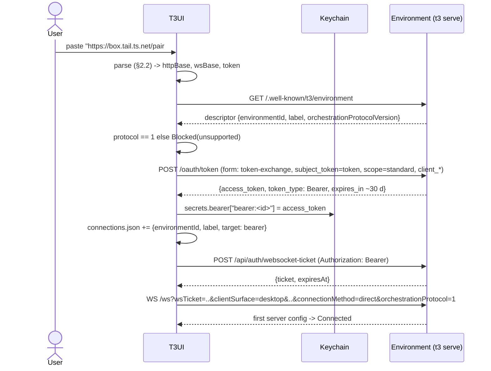

# Connections: environments, pairing, and T3 Connect

> **Stale UI warning (2026-10-02):** this spec was written against a July checkout of the fork
> (`ddeeb09`), 4,601 commits behind the real target (`fe7d3092c`, see AGENTS.md). UI details may be
> wrong until a "Refreshed against fe7d3092c" note appears here. Protocol facts are unaffected.


Reference for implementing environment management, pairing/auth and T3 Connect in `t3-client`
(networking, catalog, auth) and `t3-app` (Connections settings UI). Native macOS app: no Electron,
no embedded browser engine; we can open the system browser, use `ASWebAuthenticationSession`, and
register a URL scheme.

Path prefixes:

- `U:` = `~/L-Projects/t3UI-refs/t3code-upstream/` (upstream main, v0.0.44). Truth for wire protocol.
- `F:` = `~/L-Projects/t3code-again/` (fork, v0.0.28). Truth for UI flows and copy.

Pointers are `path:line`. Where fork and upstream differ on protocol, upstream wins (users run
`npx t3@nightly serve`). "Verified live" means checked against a public, unauthenticated endpoint on
2026-10-01.

---

## 0. Constants and glossary

### 0.1 Public production configuration

These are public identifiers baked into official builds (`U:.env.example:9-26`). They are not
secrets.

| Name | Value | Notes |
| --- | --- | --- |
| Clerk publishable key | `pk_live_Y2xlcmsudDMuY29kZXMk` | base64 of `clerk.t3.codes$` |
| Clerk Frontend API (FAPI) | `https://clerk.t3.codes` | derived from the key, `U:packages/shared/src/relayAuth.ts:31-78` |
| Clerk JWT template | `t3-relay` | claims `{"aud":"t3-code-relay"}`, `U:docs/operations/connect-setup.md:50-61` |
| Clerk CLI OAuth client id | `hzxSgY2cH10sDU2r` | public PKCE client, no secret |
| CLI OAuth loopback redirect | `http://127.0.0.1:34338/callback` | only registered redirect, `U:apps/server/src/cloud/publicConfig.ts:21`, `U:docs/operations/connect-setup.md:42` |
| OAuth scopes (CLI) | `openid profile email offline_access` | `U:packages/shared/src/connectAuth.ts:22` |
| Relay URL / issuer | `https://relay.t3.codes` | no trailing slash; must equal `resource` in token exchange (verified live) |
| Hosted app | `https://app.t3.codes` | `U:packages/shared/src/connectAuth.ts:15` |
| Clerk account portal | `https://accounts.t3.codes` | sign-in `/sign-in`, sign-up `/sign-up`, device page `/device` (verified live from `GET https://clerk.t3.codes/v1/environment`) |
| Desktop OAuth redirects (Clerk native allowlist) | `t3code://app/`, `t3code-dev://app/` | `U:docs/operations/connect-setup.md:63-73` |
| Relay public client ids | `t3-web`, `t3-mobile` | `U:packages/contracts/src/relay.ts:747-750` |

Clerk OIDC discovery (verified live, `GET https://clerk.t3.codes/.well-known/openid-configuration`):
`authorization_endpoint=/oauth/authorize`, `token_endpoint=/oauth/token`,
`device_authorization_endpoint=/oauth/device_authorization`,
`revocation_endpoint=/oauth/token/revoke`, `userinfo_endpoint=/oauth/userinfo`,
grants `authorization_code refresh_token urn:ietf:params:oauth:grant-type:device_code`,
PKCE `S256`, token auth `none` allowed.

Clerk instance settings (verified live, `GET https://clerk.t3.codes/v1/environment?_is_native=1`):
`native_settings.api_enabled=true`; first factors `email_code`, `password`, `oauth_apple`,
`oauth_github`, `oauth_google`, `oauth_microsoft`, `passkey`, `ticket`; no second factors;
`single_session_mode=true`; sign-up has captcha (`sign_up.captcha_enabled=true`); sign-in has none.

Relay discovery (verified live):

```text
GET https://relay.t3.codes/.well-known/oauth-authorization-server
{"issuer":"https://relay.t3.codes","token_endpoint":"https://relay.t3.codes/v1/client/dpop-token",
 "grant_types_supported":["urn:ietf:params:oauth:grant-type:token-exchange"],
 "token_endpoint_auth_methods_supported":["none"],"dpop_signing_alg_values_supported":["ES256"],
 "scopes_supported":["environment:connect","environment:status","mobile:registration"]}
GET https://relay.t3.codes/health  ->  {"ok":true,"service":"relay"}
GET https://relay.t3.codes/v1/environments (no auth) -> 401
{"_tag":"RelayAuthInvalidError","code":"auth_invalid","reason":"invalid_bearer","traceId":"..."}
```

### 0.2 Glossary

| Term | Meaning |
| --- | --- |
| Environment | One running `t3` server (machine + state). Identified by a stable `environmentId` that survives restarts and URL changes (`U:docs/internals/remote.md:9-21`). |
| Descriptor | `GET /.well-known/t3/environment` JSON: id, label, platform, version, capabilities. |
| Connection target | How the client reaches an environment: Primary, Bearer (paired URL), Relay (T3 Connect), Ssh. |
| Pairing credential | One-time bootstrap token (12 chars) exchanged for a session. |
| Bearer session | Long-lived (30 d) environment access token from pairing. |
| Relay | Cloud control plane at `relay.t3.codes`. Not in the data path. |
| Managed endpoint | Cloudflare tunnel hostname the relay provisioned for a linked environment, `https://<label>.<tunnel-zone>/`. |
| DPoP | RFC 9449 proof-of-possession. ES256 key held by the client; every request carries a signed proof. |
| Clerk session JWT | Short-lived JWT from Clerk FAPI for the template `t3-relay`. The only credential the relay's DPoP token exchange accepts. |
| Clerk OAuth token | Access token from the CLI OAuth app (PKCE/device). Accepted by relay bearer endpoints only. |

---

## 1. Environment model

### 1.1 Environment identity and descriptor

`GET {httpBaseUrl}/.well-known/t3/environment` (no auth) returns `ExecutionEnvironmentDescriptor`
(`U:packages/contracts/src/environment.ts:191-200`, endpoint `U:packages/contracts/src/environmentHttp.ts:412`):

```json
{
  "environmentId": "string",
  "label": "string (non-empty)",
  "platform": { "os": "darwin|linux|windows|unknown", "arch": "arm64|x64|other", "machine": "server|cloud|linux|desktop|laptop|mac-mini|mac-studio (optional)" },
  "serverVersion": "0.0.45-nightly...",
  "orchestrationProtocolVersion": 1,
  "capabilities": { "repositoryIdentity": false, "connectionProbe": true, "...": "many optional booleans" }
}
```

Rules:

- `orchestrationProtocolVersion` missing means 1. Client protocol is 1 (`U:packages/contracts/src/environment.ts:13-14`). If they differ, block with reason `unsupported`:
  - server newer: `This client is not supported by this server. Update your app or use a compatible release to connect to {label}.`
  - server older: `This client requires a newer server. Update T3 Code on {label} to connect.`
  - (`U:packages/client-runtime/src/connection/compatibility.ts:9-24`)
- Every WebSocket URL gets `orchestrationProtocol=1` appended (`U:packages/client-runtime/src/connection/compatibility.ts:26-30`).
- The descriptor `environmentId` must equal the saved/expected id; otherwise block (`configuration`): `Connected environment {actual} does not match {expected}.` (`U:packages/client-runtime/src/connection/errors.ts:27-35`).
- Capabilities: decode leniently, unknown keys ignored, missing booleans mean "unsupported".

### 1.2 Connection targets, profiles, credentials

Source: `U:packages/client-runtime/src/connection/model.ts:9-50`, `U:packages/client-runtime/src/connection/catalog.ts:13-130`.
All records are Effect `TaggedClass` (JSON has `_tag`).

| Target `_tag` | Fields | Profile | Credential | Persisted? |
| --- | --- | --- | --- | --- |
| `PrimaryConnectionTarget` | `environmentId, label, httpBaseUrl, wsBaseUrl` | none | platform-supplied bearer (desktop bootstrap) | No, reconciled from the host each launch |
| `BearerConnectionTarget` | `environmentId, label, connectionId` | `BearerConnectionProfile{connectionId, environmentId, label, httpBaseUrl, wsBaseUrl}` | `BearerConnectionCredential{token}` | Yes |
| `RelayConnectionTarget` | `environmentId, label` | none | minted on demand via relay (DPoP), cached as `RemoteDpopAccessToken` | Yes |
| `SshConnectionTarget` | `environmentId, label, connectionId` | `SshConnectionProfile{connectionId, environmentId, label, target: DesktopSshEnvironmentTarget}` | bearer minted per connect | Yes |

- `connectionId` format: `bearer:{environmentId}` (`U:packages/client-runtime/src/connection/onboarding.ts:103`), `ssh:{environmentId}` (`:221`). Desktop-local WSL backends use `local:...` (fork UI shows "Managed above" for them).
- `ConnectionCatalogEntry = { target, profile?: Profile, enabled: boolean, unsupportedReason?: string }` (`U:.../catalog.ts:39-46`). `enabled=false` means saved but never connects.
- Catalog is keyed by `environmentId`: one entry per environment. Re-registering the same id replaces target/profile/credential but keeps the disabled flag (`U:packages/client-runtime/src/platform/storageDocument.ts:74-105`).
- Label: always the descriptor `label` at registration (pairing) or the relay record `label` (T3 Connect). Not user-editable in the fork UI (runtime has `updateBearer`, unused by UI).

### 1.3 Persisted catalog document

`ConnectionCatalogDocument` (`U:packages/client-runtime/src/platform/storageDocument.ts:20-43`):

```json
{
  "schemaVersion": 1,
  "targets": [
    { "_tag": "BearerConnectionTarget", "environmentId": "env-1", "label": "studio", "connectionId": "bearer:env-1" },
    { "_tag": "RelayConnectionTarget", "environmentId": "env-2", "label": "devbox" }
  ],
  "profiles": [
    { "_tag": "BearerConnectionProfile", "connectionId": "bearer:env-1", "environmentId": "env-1", "label": "studio",
      "httpBaseUrl": "https://studio.tail1234.ts.net/", "wsBaseUrl": "wss://studio.tail1234.ts.net/" }
  ],
  "credentials": [
    { "connectionId": "bearer:env-1", "credential": { "_tag": "BearerConnectionCredential", "token": "<bearer>" } }
  ],
  "remoteDpopTokens": [
    { "environmentId": "env-2", "accountId": "user_...", "label": "devbox",
      "endpoint": { "httpBaseUrl": "https://prod-xxxx.<zone>/", "wsBaseUrl": "wss://prod-xxxx.<zone>/ws", "providerKind": "cloudflare_tunnel" },
      "accessToken": "<env DPoP token>", "expiresAtEpochMs": 0, "dpopThumbprint": "<jkt>" }
  ],
  "githubRoutingPermissions": [],
  "disabledEnvironmentIds": []
}
```

Where it lives:

| Client | Storage | Pointer |
| --- | --- | --- |
| Web | IndexedDB `t3code:connection-runtime` v4, store `catalog`, key `document` (also stores `shell`, `thread`, `server-config`, `vcs-refs` caches) | `U:apps/web/src/connection/storage.ts:47-54` |
| Desktop | `~/.t3/userdata/connection-catalog.json` = `{"version":1,"encryptedCatalog":"<base64(Electron safeStorage.encryptString(json))>"}`, atomic temp+rename. If safeStorage is unavailable the catalog is not persisted. | `U:apps/desktop/src/app/DesktopConnectionCatalogStore.ts:29-33,220-282,387` |
| Desktop legacy | `~/.t3/userdata/saved-environments.json` with `PersistedSavedEnvironmentRecord{environmentId,label,wsBaseUrl,httpBaseUrl,createdAt,lastConnectedAt,desktopSsh?,relayManaged?{relayUrl}}`, migrated once into the catalog | `U:packages/contracts/src/ipc.ts:470-483`, `U:apps/desktop/src/app/DesktopConnectionCatalogStore.ts:288-377` |
| Mobile | Expo SecureStore / app storage | `U:apps/mobile/src/connection/platform.ts` |

Desktop state dir: `{T3CODE_HOME or ~/.t3}/userdata` (`dev` in development) (`U:apps/desktop/src/app/DesktopStatePaths.ts:18-31`).

### 1.4 Primary (local) environment

- Desktop normally spawns its own server and registers it as `PrimaryConnectionTarget`, authenticated with a desktop-bootstrap grant (24 h, unlimited uses, admin scopes; `U:apps/server/src/auth/PairingGrantStore.ts:240-248,314-328`). It cannot be removed (`PlatformEnvironmentRemovalError`, `U:packages/client-runtime/src/connection/registry.ts:657-664`).
- Desktop setting `localEnvironmentEnabled=false` runs desktop without a local server; only saved environments connect (`U:docs/internals/remote.md:61-71`). The fork has no UI toggle for this.
- Hosted web (`app.t3.codes`) has no primary.
- The fork treats the primary specially in the UI: listed first in "Run on", icon MonitorIcon, "This device" fallback label, excluded from "Remote environments" (see §6).
- Native app phase 1: no primary. See §5 for hosting a local server later.

### 1.5 Lifecycle semantics

`U:packages/client-runtime/src/connection/registry.ts`

- Register: install entry, create supervisor; if `enabled`, `connect` immediately (`:278-319`).
- Disable (`setEnabled(id,false)`): keep registration, credentials and cache; supervisor goes to `available` (`:745-...`).
- Remove (`remove`): delete target/profile/credential/remote token, close supervisor, clear cached projections and drafts, disconnect SSH if applicable (`:657-717`). The fork's "Disconnect" button calls this (it forgets the environment; no confirm).
- Unsupported: a `blocked` failure with reason `unsupported` auto-disables the entry and stores `unsupportedReason`; re-enabling fails with that reason until compatible (`:303-318, 839-860`).
- Cloud account change or sign-out: remove all `RelayConnectionTarget` entries and reset the relay token cache. Directly paired environments are untouched (`U:apps/web/src/cloud/managedAuth.tsx:52-99`, `registry.ts:719-743`).
- Involuntary disconnect keeps registration and cached data (`U:docs/internals/connection-runtime.md:20-28`).

### 1.6 Supervisor state machine (per environment)

`U:packages/client-runtime/src/connection/supervisor.ts`, model `U:packages/client-runtime/src/connection/model.ts:128-176`.

State: `{ desired, network: unknown|offline|online, phase, stage: preparing|opening|synchronizing|null, attempt, generation, lastFailure, retryAt }`.

| Phase | Entered when | Leaves on |
| --- | --- | --- |
| `available` | `desired=false` | `ConnectRequested` |
| `offline` | desired and network offline | network online, app-active wakeup (resets ladder) |
| `connecting` | attempt running; `stage` advances preparing -> opening -> synchronizing | success -> `connected`; failure -> `backoff`/`blocked`; 15 s establishment timeout -> transient failure |
| `connected` | session ready (first server config received) | socket close, Disconnect/Retry, network offline, `credentials-changed` (relay only), `application-active-reconnect` |
| `backoff` | transient failure | timer, any signal; app-active wakeup resets ladder |
| `blocked` | `ConnectionBlockedError` (auth, configuration, permission, unsupported) | any signal (no timer). App-active wakeup resets ladder |

Errors (`model.ts:60-104`):

- `ConnectionTransientError.reason`: `network | timeout | transport | endpoint-unavailable | relay-unavailable | remote-unavailable` -> retry with backoff.
- `ConnectionBlockedError.reason`: `authentication | configuration | permission | unsupported` -> wait for a signal.
- Both carry `detail` (user-facing message) and optional `traceId`.

Timing:

| Constant | Upstream | Fork |
| --- | --- | --- |
| Retry ladder (by failure count) | 3 s, 4 s, 8 s, 16 s (cap) `supervisor.ts:32` | 1 s, 2 s, 4 s, 8 s, 16 s |
| Establishment timeout | 15 s `:33` | same |
| WebSocket open timeout | 15 s `U:packages/client-runtime/src/rpc/session.ts:45` | same |
| Foreground probe timeout | 15 s desktop, 3 s mobile `:34-35` | 15 s |
| Ladder reset after stable connection | 30 s connected `:36` | same |
| Timeout detail | `{label} did not respond during connection setup.` (+ network hint for relay) `:223-225` | |

Signals and wakeups (`U:packages/client-runtime/src/connection/wakeups.ts:5-31`): `ConnectRequested`,
`DisconnectRequested`, `RetryRequested` (resets ladder; the "Connect"/"Reconnect" buttons),
`NetworkChanged`, `Wakeup(application-active | application-active-probe | application-active-reconnect | credentials-changed)`.
Desktop/web emit `application-active` on `visibilitychange` to visible and network status from
`online`/`offline` events (`U:apps/web/src/connection/platform.ts:67-110`). In `connected`,
`application-active` runs `session.probe` (RPC `server.probe` if capability `connectionProbe`, else
`server.getConfig`); a failed probe triggers an immediate reconnect without backoff
(`supervisor.ts:395-487, 714-722`).

Native mapping: app activation (`NSApplicationDidBecomeActiveNotification`) and wake from sleep
(`NSWorkspaceDidWakeNotification`) -> `application-active`; `NWPathMonitor` -> network status.

Presentation (`U:packages/client-runtime/src/connection/presentation.ts:28-87`):

| Supervisor | UI phase | `connectionStatusText` |
| --- | --- | --- |
| available | available | `Available` |
| offline | offline | `Offline` |
| connecting, attempt<=1 and no lastFailure | connecting | `Connecting...` |
| connecting (retry) / backoff | reconnecting | `Reconnecting...` or `Failed to connect. Reconnecting... Reason: {error}` |
| connected | connected | `Connected` |
| blocked, reason unsupported | unsupported (upstream only) | `Client not supported` |
| blocked, other | error | `Connection failed` or `Connection failed. Reason: {error}` |

Fork has no `unsupported` phase; it shows `error` (`F:packages/client-runtime/src/connection/presentation.ts`).
Display URL per target: Primary/Bearer `httpBaseUrl`, SSH `user@host`, Relay none (`presentation.ts:95-110`).

### 1.7 Multiple environments in the UI

Each project and thread belongs to exactly one environment. Detailed UI in §6.1. Summary:

- Sidebar groups projects across environments by repository identity; remote-only projects get a cloud badge.
- Composer "Run on" picker appears when a logical project spans more than one environment; locked once the thread has messages.
- Thread view shows a banner with `{label}: {connectionStatusText}` and "Reconnect"/"Connections" buttons when its environment is not connected.
- Command palette "Add project" asks which environment.

---

## 2. Adding an environment that runs `t3 serve`

### 2.1 What the server prints

`t3 serve` = headless startup (`U:apps/server/src/cli/server.ts:28-32`). After listening it prints
(`U:apps/server/src/startupAccess.ts:122-131`, called from `U:apps/server/src/serverRuntimeStartup.ts:1021-1026`):

```text
T3 Code server is ready.
Connection string: http://<host>:<port>
Token: <PAIRING_TOKEN>
Pairing URL: http://<host>:<port>/pair#token=<PAIRING_TOKEN>

<QR code of the pairing URL, half-block characters>
```

- `<host>`: `--host` value; if unset or `localhost` it prints `localhost`; for a wildcard bind (`0.0.0.0`, `::`) it prints the first non-internal IPv4, else IPv6, else `localhost` (`startupAccess.ts:45-78`). With no `--host` the server binds `127.0.0.1` (`U:apps/server/src/server.ts:248`). With the user's command (`serve --mode web --tailscale-serve`) the printed host is `localhost` and the server is reachable from other machines only through Tailscale Serve.
- `<port>`: default 3773; web mode picks the first free port from 3773 (`U:apps/server/src/config.ts:23`, `U:apps/server/src/cli/config.ts:300-306`).
- Token: 12 chars from `23456789ABCDEFGHJKLMNPQRSTUVWXYZ` (`U:apps/server/src/auth/PairingGrantStore.ts:258-259`). One use. Expires 5 minutes after issue (`:239`). The startup token carries admin scopes (`AuthAdministrativeScopes`, `U:apps/server/src/auth/EnvironmentAuth.ts:989-995`).
- The pairing URL always uses path `/pair` and puts the token in the **fragment** `#token=` (`startupAccess.ts:92-98`). Clients must also accept `?token=`.
- `--tailscale-serve` (default HTTPS port 443, `--tailscale-serve-port N`) runs `tailscale serve` to proxy `https://<machine>.<tailnet>.ts.net[:N]/` to `http://127.0.0.1:<port>` and removes the mapping on shutdown (`U:apps/server/src/server.ts:683-730`). The printed lines do not include the Tailscale URL.
- For a fresh link without restarting: `t3 pair` (and `t3 pair --tailscale` prints the `https://<machine>.<tailnet>.ts.net/` form). See §5 for flags.
- The user can also create links from another already-paired admin client ("Create link", §6.3.2), which calls `POST /api/auth/pairing-token`.

Practical consequence for the user's setup: add the environment with Host =
`https://<machine>.<tailnet>.ts.net` (port if not 443) and Pairing code = the 12-char token, within
5 minutes of startup, or run `t3 pair --tailscale` on the host for a fresh link.

### 2.2 Accepted inputs and parse rules

`resolveRemotePairingTarget` (`U:packages/shared/src/remote.ts:188-245`); fork UI field splitting in §6.3.1.

Input forms:

1. Pairing URL: `http(s)|ws(s)://host[:port]/pair#token=TOKEN` (or `?token=`). Token read from the fragment first, then the query (`remote.ts:144-152`). Base URL = scheme+host+port with path `/`.
2. Hosted pairing URL: `https://app.t3.codes/pair?host=<backend>&label=<label>#token=TOKEN` (`remote.ts:172-186`, `U:apps/web/src/hostedPairing.ts:73-81`). Base URL = normalized `host` param.
3. Host + code: `host` (scheme optional) and `pairingCode`.

Host normalization (`remote.ts:75-104`): trim; strip leading `/` (upstream); prefix `https://` when there is no `scheme://`; allowed protocols `http: https: ws: wss:`; path/query/fragment cleared.
Derived URLs (`remote.ts:106-130`): `httpBaseUrl` (ws->http, wss->https, path `/`) and `wsBaseUrl` (http->ws, https->wss, path `/`).

Error messages (exact): `Enter a backend URL.`, `Backend URL is invalid.`, `Pairing URL is invalid.`,
`Pairing URL is missing its token.`, `Enter a pairing code.` (`remote.ts:11-61`).

Note: a bare IP without scheme becomes `https://`. A plain-HTTP LAN server must be entered with `http://`.

### 2.3 HTTP sequence

`preparePairingRegistration` (`U:packages/client-runtime/src/connection/onboarding.ts:87-122`):

1. `GET {httpBaseUrl}.well-known/t3/environment` (10 s timeout). Check protocol (§1.1).
2. `POST {httpBaseUrl}oauth/token` (no `DPoP` header => bearer token), `Content-Type: application/x-www-form-urlencoded`
   (`U:packages/client-runtime/src/authorization/remote.ts:115-140`, contract `U:packages/contracts/src/auth.ts:186-205`):

   ```text
   grant_type=urn:ietf:params:oauth:grant-type:token-exchange
   subject_token=<PAIRING_TOKEN>
   subject_token_type=urn:t3:params:oauth:token-type:environment-bootstrap
   requested_token_type=urn:ietf:params:oauth:token-type:access_token
   scope=orchestration:read orchestration:operate terminal:operate review:write relay:read
   client_label=T3 Code Desktop
   client_device_type=desktop
   client_os=macOS
   ```

   - `scope` is optional; omitted means the grant's full scopes. Clients send `AuthStandardClientScopes` (`U:packages/contracts/src/auth.ts:103-109`). Requesting more than the grant fails `scope_not_granted` (`U:apps/server/src/auth/EnvironmentAuth.ts:808-812`). Scopes are single-space separated, no duplicates (`U:packages/shared/src/oauthScope.ts`).
   - Allowed scopes: `orchestration:read orchestration:operate terminal:operate review:write access:read access:write relay:read relay:write`.
   - Optional fields only label the session in the host's "Authorized clients" list. The desktop sends label `T3 Code Desktop`, device type `desktop`, OS `macOS|Windows|Linux` (`U:apps/web/src/connection/clientMetadata.ts:72-97`). A native app can send its own label.

   Response 200 (`AuthAccessTokenResult`):

   ```json
   {"access_token":"<opaque>","issued_token_type":"urn:ietf:params:oauth:token-type:access_token",
    "token_type":"Bearer","expires_in":2591999,"scope":"orchestration:read orchestration:operate terminal:operate review:write relay:read"}
   ```

   Bearer sessions last 30 days (`U:apps/server/src/auth/SessionStore.ts:423`). There is no refresh; on expiry or revocation the user must pair again.
3. Register: target `BearerConnectionTarget{environmentId, label: descriptor.label, connectionId: "bearer:"+environmentId}`, profile with `httpBaseUrl/wsBaseUrl`, credential `{token: access_token}`. Then the supervisor connects.

Failure responses are JSON with `_tag` (`U:packages/contracts/src/environmentHttp.ts:66-211`):

| HTTP | `_tag` / `code` | `reason` | Client detail (`U:packages/client-runtime/src/connection/errors.ts:115-172`) |
| --- | --- | --- | --- |
| 400 | `EnvironmentRequestInvalidError` / `invalid_request` | `invalid_scope`, `scope_not_granted`, `invalid_command` | `The environment rejected the authentication request.` |
| 401 | `EnvironmentAuthInvalidError` / `auth_invalid` | `missing_credential`, `invalid_credential` (+ optional `dpopFailureReason`) | `The environment credential is invalid.` |
| 403 | `EnvironmentScopeRequiredError` / `insufficient_scope` | `requiredScope` | `The environment credential does not grant the required access.` |
| 500 | `EnvironmentInternalError` / `internal_error` | e.g. `access_token_issuance_failed` | `The environment could not authorize the connection.` |
| timeout / network | client-side | | transient, message from the HTTP layer |

All carry `traceId`. A used or expired pairing token returns 401 `invalid_credential`.

### 2.4 Using the bearer credential

Per connect attempt (`U:packages/client-runtime/src/authorization/service.ts:135-193`):

1. Descriptor fetch (reuse if validated <10 s ago for the same URL) and id check.
2. `POST {httpBaseUrl}api/auth/websocket-ticket` with `Authorization: Bearer <token>`, empty body -> `{"ticket":"<opaque>","expiresAt":"<ISO>"}` (5 min TTL, `U:apps/server/src/auth/SessionStore.ts:424`).
3. Open `{wsBaseUrl}ws?wsTicket=<ticket>&<client params>&orchestrationProtocol=1`. If `wsBaseUrl` path is empty or `/`, use `/ws`; keep a non-root path (relay endpoints already end in `/ws`) (`U:packages/client-runtime/src/authorization/remote.ts:201-224`).

Client params (`remote.ts:42-84`): `clientSurface=desktop`, `clientAppVersion=<ver>`,
`clientDeviceType=desktop|phone|tablet|unknown`, `clientOs=macOS|Windows|Linux|iOS|Android|ChromeOS|other|unknown`,
`connectionMethod=direct|ssh|relay`. Old servers ignore them. Web-only: `clientWebDeployment`, `clientBrowser`.

HTTP requests to the environment (snapshots, PR diffs, attachments): `Authorization: Bearer <token>`.
Do not send a `DPoP` header with a bearer token; the server rejects DPoP authorization for a
non-bound token (`U:apps/server/src/auth/EnvironmentAuth.ts:638-690`).

Server credential selection order: cookie, `Bearer`, `DPoP`, legacy cookie (`EnvironmentAuth.ts:572-597`).
WS upgrade: `wsTicket` query param first, else the same header/cookie logic (`:1075-1093`).

Session self-check: `GET /api/auth/session` with `Authorization: Bearer` -> `AuthSessionState{authenticated, auth{policy, bootstrapMethods, sessionMethods, sessionCookieName}, scopes?, sessionMethod?, expiresAt?}` (`U:packages/contracts/src/auth.ts:348-354`).

### 2.5 Keepalive

Not part of auth but part of connection health: the WebSocket uses Effect RPC framing. The client
sends `{"_tag":"Ping"}` every 5 s; if the previous ping got no `{"_tag":"Pong"}` by the next tick
the socket fails with "ping timeout" (`F:node_modules/.pnpm/effect@4.0.0-beta.78*/node_modules/effect/dist/unstable/rpc/RpcClient.js:696-716`).
The session is "ready" only after the first `subscribeServerConfig` event (`U:packages/client-runtime/src/rpc/session.ts:382-386`).
Details belong to the RPC spec.

### 2.6 `--tailscale-serve` implications

- URL: `https://<machine>.<tailnet>.ts.net/` (or `:<port>`), valid Let's Encrypt cert; rustls with native or webpki roots works. WebSocket is `wss://<same>/ws`.
- Tailscale Serve runs `tailscale serve --bg --https=<servePort> http://127.0.0.1:<port>` (`U:packages/tailscale/src/tailscale.ts:341-350`) and forwards to the loopback-bound server; the environment sees loopback peers, but auth is still token-based (policy for web mode with no `--host` is `loopback-browser`; it still accepts one-time tokens; `U:apps/server/src/auth/EnvironmentAuthPolicy.ts:23-42`).
- There is no tailnet peer discovery anywhere (only `Self.DNSName` and `Self.TailscaleIPs` are read from `tailscale status --json`, `U:packages/tailscale/src/tailscale.ts:129-273`). The user types the `ts.net` URL.
- Only tailnet members can reach it. MagicDNS must be enabled on the client Mac.
- First request to a fresh `ts.net` hostname can be slow while Tailscale provisions the cert (`U:apps/server/src/cli/pair.ts:63`). Use generous timeouts on the first descriptor fetch.
- Hosted web pairing links (`app.t3.codes/pair?host=...`) are only generated for `https:` endpoints (`F:apps/web/src/components/settings/pairingUrls.ts:10-20`).

### 2.7 Fork add-environment UX

See §6.3.1 (Add Environment dialog) and §6.4 (`/pair` surfaces). Success toast: `Backend added` /
`The environment is saved and will reconnect on app startup.`

---

## 3. T3 Connect

### 3.1 What it is

A hosted control plane that lets a signed-in user reach their own environments from other devices
without port forwarding (`U:infra/relay/README.md`, `U:docs/internals/t3-connect.md`).

- Identity: Clerk (`clerk.t3.codes`).
- Relay (`relay.t3.codes`, Cloudflare Worker + Postgres): stores environment links, provisions a Cloudflare tunnel per linked environment, lists a user's environments, and brokers one-time credentials.
- Data path: after bootstrap, the client talks HTTP/WebSocket directly to the environment's tunnel hostname. The relay does not proxy traffic. TLS is Cloudflare's; there is no extra application-layer encryption.
- Trust: the relay asks the environment to mint a one-time bootstrap credential bound to the client's DPoP key. The client exchanges it directly with the environment. The relay never sees the environment session token (`U:docs/internals/t3-connect.md:11-39`).
- Hosts link with `t3 connect` (CLI) or the desktop "T3 Connect" switch. A link outlives the server process; tunnels of offline hosts may be reclaimed and recreated with the same hostname (`U:docs/internals/t3-connect.md:41-107`).

### 3.2 Credentials and which endpoint accepts which

| Credential | Obtained from | Lifetime | Accepted by |
| --- | --- | --- | --- |
| Clerk session JWT, template `t3-relay` (`aud=t3-code-relay`, `sub=user_...`) | Clerk FAPI `POST /v1/client/sessions/{sid}/tokens/t3-relay` | template lifetime (short; clients fetch with `skipCache: true`, `U:packages/shared/src/relayAuth.ts:84-89`) | relay bearer group (`GET /v1/environments`, link/unlink) and `POST /v1/client/dpop-token` |
| Clerk OAuth access token (CLI app) | `https://clerk.t3.codes/oauth/token` (PKCE or device code) | `expires_in`; refresh token via `offline_access` | relay bearer group only. **Rejected by `/v1/client/dpop-token`** |
| Relay DPoP access token (`typ t3-relay-dpop-access+jwt`) | `POST /v1/client/dpop-token` | 30 min (`U:infra/relay/src/auth/RelayTokens.ts:29`) | `POST /v1/environments/:id/connect`, `/status`, mobile endpoints |
| Environment bootstrap credential | relay `connect` response `credential` | 2 min, one use, bound to client DPoP key (`U:apps/server/src/cloud/http.ts:1550-1556`) | environment `POST /oauth/token` with DPoP |
| Environment DPoP access token | environment `POST /oauth/token` | 1 h (`U:apps/server/src/auth/EnvironmentAuth.ts:821`); scopes `AuthStandardClientScopes` only | environment HTTP (+ `DPoP` proof) and WS tickets |
| WS ticket | `POST /api/auth/websocket-ticket` | 5 min | WS upgrade `?wsTicket=` |

Evidence for the OAuth-token restriction:

- Bearer group middleware tries the session JWT first, then falls back to Clerk `authenticateRequest(..., {acceptsToken: "oauth_token"})` (`U:infra/relay/src/http/Api.ts:1540-1580`). The note "The relay accepts both session-template JWTs and CLI OAuth tokens" refers to this group (`U:docs/internals/t3-connect.md:109-120`).
- The token exchange handler calls only `verifyClerkBearerToken(config, subject_token)` and requires `aud` to contain the relay audience (`U:infra/relay/src/http/Api.ts:939-945`). Clerk OAuth tokens fail this.

### 3.3 Relay API reference

Contract: `U:packages/contracts/src/relay.ts:948-1194`. Handlers: `U:infra/relay/src/http/Api.ts`.
Client implementation: `U:packages/client-runtime/src/relay/managedRelay.ts`. Client-side request
timeout 10 s (`managedRelay.ts:225`). JSON bodies unless noted. All errors are JSON with `_tag`,
`code`, `traceId` (§3.8).

| Method, path | Auth | Request | Response |
| --- | --- | --- | --- |
| `GET /health` | none | | `{"ok":true,"service":"relay"}` |
| `GET /.well-known/oauth-authorization-server` | none | | see §0.1 |
| `GET /.well-known/oauth-protected-resource` | none | | `{resource, authorization_servers, scopes_supported, dpop_bound_access_tokens_required:true, dpop_signing_alg_values_supported:["ES256"]}` |
| `GET /v1/environments` | `Authorization: Bearer <clerk JWT or OAuth token>` | | `{"environments":[RelayClientEnvironmentRecord]}` |
| `POST /v1/client/dpop-token` | `DPoP: <proof, no ath>` (no Authorization) | form, see below | `{access_token, issued_token_type, token_type:"DPoP", expires_in:1800, scope}` |
| `POST /v1/environments/:environmentId/status` | `Authorization: DPoP <relay AT>` + `DPoP: <proof with ath>`; scope `environment:status` | no body | `RelayEnvironmentStatusResponse` |
| `POST /v1/environments/:environmentId/connect` | same; scope `environment:connect` | `{"clientKeyThumbprint":"<jkt>"}` (or `clientProofKeyThumbprint`; both accepted if equal; optional `deviceId`) | `RelayEnvironmentConnectResponse` |
| `GET /v2/client/devices` | Bearer | | `{"devices":[...]}` mobile devices (not needed) |
| `POST /v1/client/environment-link-challenges` | Bearer | `{notificationsEnabled, liveActivitiesEnabled, managedTunnelsEnabled}` | `{challenge, expiresAt}` |
| `POST /v1/client/environment-links` | Bearer | `{deviceId?, proof, notificationsEnabled, liveActivitiesEnabled, managedTunnelsEnabled}` | `RelayEnvironmentLinkResponse` |
| `DELETE /v1/client/environment-links/:environmentId` | Bearer | | `{"ok":bool}` ("Deregister") |
| `DELETE /v1/client/environment-links/:environmentId/tunnel` | Bearer | | `{"ok":bool}` (hosts call on shutdown) |

Records (`relay.ts:165-170, 701-712, 815-835`):

```json
RelayClientEnvironmentRecord = {
  "environmentId": "string",
  "label": "string (falls back to environmentId)",
  "endpoint": { "httpBaseUrl": "https://prod-<digest>.<tunnel-zone>/", "wsBaseUrl": "wss://prod-<digest>.<tunnel-zone>/ws",
                "providerKind": "manual | cloudflare_tunnel | t3_relay" },
  "linkedAt": "ISO string"
}
RelayEnvironmentStatusResponse = {
  "environmentId": "...", "endpoint": {...}, "status": "online | offline", "checkedAt": "ISO",
  "descriptor": ExecutionEnvironmentDescriptor (optional), "error": "string (optional)", "traceId": "string (optional)"
}
RelayEnvironmentConnectResponse = {
  "environmentId": "...", "endpoint": {...}, "credential": "<bootstrap credential>", "expiresAt": "ISO"
}
```

Endpoint URL format: `https://{host}/` and `wss://{host}/ws`, `providerKind: "cloudflare_tunnel"`
(`U:infra/relay/src/deploymentConfig.ts:112-118`). Production hosts are `prod-<digest>.<RELAY_TUNNEL_ZONE_NAME>`
(`U:infra/relay/README.md`). A `manual` provider means publish-only (no tunnel); such environments
cannot be connected through the relay (`environment_connect_not_authorized` / `endpoint_provider_not_managed`).

Token exchange form (`relay.ts:752-778`, client `managedRelay.ts:484-525`), `Content-Type: application/x-www-form-urlencoded`:

```text
grant_type=urn:ietf:params:oauth:grant-type:token-exchange
subject_token=<Clerk session JWT, template t3-relay>
subject_token_type=urn:ietf:params:oauth:token-type:jwt
requested_token_type=urn:ietf:params:oauth:token-type:access_token
resource=https://relay.t3.codes
scope=environment:connect environment:status
client_id=t3-web
```

- `resource` must equal the issuer exactly (`Api.ts:934-937`), else 401.
- `client_id` scopes: `t3-web` may request `environment:connect environment:status`; `t3-mobile` also `mobile:registration` (`U:infra/relay/src/auth/RelayTokens.ts:63-73`). Use `t3-web`.
- The client must verify the response `scope` equals the requested set, else fail (`managedRelay.ts:517-522`).
- Cache the access token by `(accountId=sub of Clerk JWT, clientId, relayUrl, thumbprint, scopes)`; reuse while `expiresAt > now+5s` (`managedRelay.ts:364-383`). On a `RelayAuthInvalidError{reason:"invalid_bearer"}` from a DPoP call, drop the cached token and retry once (`managedRelay.ts:655-692`).
- Web discovery requests both scopes in one token so status and connect share it (`U:packages/client-runtime/src/relay/discovery.ts:156-160`).

### 3.4 DPoP details

One P-256 key per client install, persisted (web: IndexedDB `t3code:cloud-auth` store `keys`, key
`relay-dpop-proof-key`, `U:apps/web/src/cloud/dpop.ts:24-27`). The same key is used for the relay and
for every environment.

Proof JWT (`U:apps/web/src/cloud/dpop.ts:145-185`, verifier `U:packages/shared/src/dpop.ts:113-199`):

```text
header  = {"typ":"dpop+jwt","alg":"ES256","jwk":{"kty":"EC","crv":"P-256","x":"<b64url 32B>","y":"<b64url 32B>"}}
payload = {"htm":"POST","htu":"<request URL without query/fragment>","jti":"<uuid v4>","iat":<unix seconds>,
           "ath":"<b64url(sha256(access_token))>"}   // ath only when presenting an access token
proof   = b64url(header) "." b64url(payload) "." b64url(r||s)   // ES256 over the ASCII signing input, 64-byte raw signature
```

- `jwk` must not contain `d` (`dpop.ts:33-36`); include exactly `kty, crv, x, y`.
- `htm` is compared case-insensitively; `htu` must equal the server's view of the URL with query and fragment removed, WHATWG-serialized (`U:packages/shared/src/dpopCommon.ts:11-20`). Build it from the same URL you request.
- `iat` must be within `[now-300 s, now+5 s]` on the verifier (`dpop.ts:178-188`). Clock skew breaks auth; surface the hint `Hint: Check that automatic date and time is enabled on both devices, then try again.` when `dpopFailureReason="time_window"` (`U:packages/client-runtime/src/relay/errorPresentation.ts:4-22`).
- `jti` is replay-guarded per key: a proof is single-use (environment stores markers, `U:apps/server/src/auth/dpop.ts:87-125`). Create a new proof for every HTTP request.
- Thumbprint (`jkt`): `b64url(sha256('{"crv":"P-256","kty":"EC","x":"<x>","y":"<y>"}'))`, keys sorted, no whitespace (RFC 7638) (`U:packages/shared/src/dpop.ts:83-94`).
- `DpopFailureReason`: `time_window | key_mismatch | request_mismatch | token_mismatch | replay | invalid_proof` (`U:packages/contracts/src/baseSchemas.ts:25-32`). Returned as `dpopFailureReason` in 401 bodies, plus header `www-authenticate: DPoP`.

Where proofs go:

| Request | `Authorization` | `DPoP` proof `ath`? |
| --- | --- | --- |
| relay `POST /v1/client/dpop-token` | none | no |
| relay `POST /v1/environments/:id/status`, `/connect` | `DPoP <relay AT>` | yes (relay AT) |
| env `POST /oauth/token` (bootstrap) | none | no; its key must match the credential's bound thumbprint |
| env `POST /api/auth/websocket-ticket` | `DPoP <env AT>` | yes (env AT) |
| env any other HTTP API | `DPoP <env AT>` | yes (env AT) |

### 3.5 Connect sequence (relay environment)

`U:packages/client-runtime/src/authorization/service.ts:251-493`, `U:packages/client-runtime/src/connection/resolver.ts:157-177`:

1. Clerk session JWT (`t3-relay`), fresh.
2. Relay access token (cached or `POST /v1/client/dpop-token`).
3. `POST /v1/environments/{id}/connect` with `{"clientKeyThumbprint":"<jkt>"}`. Verify `environmentId` matches. Relay side: signs a mint request JWT (2 min) and calls the environment's `POST /api/t3-connect/mint-credential` through the tunnel without redirects, 10 s timeout, and verifies the signed response binds nonce and thumbprint (`U:infra/relay/src/environments/EnvironmentConnector.ts:541-672`).
4. `GET {endpoint.httpBaseUrl}.well-known/t3/environment`; check id.
5. `POST {endpoint.httpBaseUrl}oauth/token` with header `DPoP: <proof htu={httpBaseUrl}oauth/token>` and form:

   ```text
   grant_type=urn:ietf:params:oauth:grant-type:token-exchange
   subject_token=<credential from step 3>
   subject_token_type=urn:t3:params:oauth:token-type:environment-bootstrap
   requested_token_type=urn:ietf:params:oauth:token-type:access_token
   scope=orchestration:read orchestration:operate terminal:operate review:write relay:read
   client_label=...&client_device_type=desktop&client_os=macOS
   ```

   -> `{"access_token":"...","token_type":"DPoP","expires_in":3599,...}` (`U:packages/client-runtime/src/authorization/remote.ts:86-113`).
6. Cache `RemoteDpopAccessToken{environmentId, accountId, label, endpoint, accessToken, expiresAtEpochMs, dpopThumbprint}`.
7. `POST {httpBaseUrl}api/auth/websocket-ticket` with `Authorization: DPoP <env AT>` + proof -> ticket.
8. WS `wss://.../ws?wsTicket=...&clientSurface=desktop&...&connectionMethod=relay&orchestrationProtocol=1`.

Reuse rules (`service.ts:337-493`):

- Reuse a cached env token if same environment, same account, same thumbprint, and `expiresAt > now + 60 s` (`DPOP_ACCESS_TOKEN_REFRESH_SKEW_MS`, `U:packages/client-runtime/src/connection/model.ts:106`).
- With a cached token, try the WS ticket with a 3 s timeout; on transient failure re-mint once; on any socket-ticket failure drop the cached token.
- One in-flight mint per environment; whole mint bounded by 30 s (`Timed out renewing the environment credential.`).
- HTTP 401 with a cached env token: call again with `rejectedAccessToken` to force a re-mint (`authorizeDpopHttp`).
- Credential expiry never closes a healthy socket; only new HTTP calls and socket upgrades need a valid token (`U:docs/internals/connection-runtime.md:30-42`).
- If the Clerk account changes mid-flight, fail with `Your cloud sign-in changed. Sign in again to authorize the environment.` (`service.ts:224-237`).

### 3.6 Listing linked environments (discovery)

`U:packages/client-runtime/src/relay/discovery.ts:205-311`:

1. If offline: state `{offline:true}`; nothing else.
2. Clerk JWT. If signed out, settle to an empty list (not an error).
3. `GET /v1/environments` -> entries with `availability: "checking"`.
4. For each environment concurrently: `POST /v1/environments/{id}/status` with a relay AT scoped `environment:status environment:connect`. Validate that `environmentId`, all three endpoint fields, and `descriptor.environmentId` match the listing (`:57-93`). Result: `online | offline` (with optional `error`), or `error` (request failed).
5. Refresh triggers: opening the list, sign-in (`credentials-changed`), network back online after a first refresh.

The relay's status check signs a 2-minute health request and calls the environment's
`POST /api/t3-connect/health` (`EnvironmentConnector.ts:395-540`); timeout means `offline` with
`error: "Managed endpoint health request timed out."`.

Selecting "Connect" registers `RelayConnectionTarget{environmentId, label}` (`U:apps/web/src/components/cloud/CloudEnvironmentConnectList.tsx:108-118`). Nothing else is stored at that moment.

### 3.7 How existing clients authenticate the user

| Client | Mechanism | Pointer |
| --- | --- | --- |
| Web (upstream) | `@clerk/react` `useAuth().getToken({template:"t3-relay", skipCache:true})`; sign-in via `clerk.openSignIn()` modal | `U:apps/web/src/cloud/managedAuth.tsx:31-103`, `U:apps/web/src/components/clerk/useT3ConnectAuthPrompt.tsx:9` |
| Web (fork) | same, but the sidebar button calls `clerk.openWaitlist()` (waitlist modal, not sign-in) | `F:apps/web/src/components/clerk/useT3ConnectAuthPrompt.tsx:6` |
| Desktop | `@clerk/electron`: renderer runs clerk-js in native mode; main process persists the Clerk client JWT and handles OAuth via the system browser with redirect `t3code://app/` | `U:apps/desktop/src/app/DesktopClerk.ts:80-89` |
| Mobile | `@clerk/expo` native `AuthView`; same template token, relay `client_id=t3-mobile` | `U:apps/mobile/src/features/settings/SettingsAuthRouteScreen.tsx:2,60`, `U:apps/mobile/src/features/cloud/CloudAuthProvider.tsx:136` |
| CLI (`t3 connect`) | Clerk OAuth app: loopback PKCE via hosted `/connect` page, or device grant (`--headless`) | `U:apps/server/src/cloud/CliTokenManager.ts:300-526` |

What `@clerk/electron` does (`F:node_modules/.pnpm/@clerk+electron@0.0.11*/node_modules/@clerk/electron/dist/esm/react/index.js`, `.../dist/esm/index.js`):

- Every FAPI request: credentials omitted, query `_is_native=1`, header `Authorization: Bearer <client JWT>` if stored.
- Every FAPI response: if it has an `Authorization` header, store its value (strip `Bearer `) as the client JWT (key `__clerk_client_jwt`).
- OAuth: `redirectUrl = "{scheme}://{host}/"` = `t3code://app/`; opens `external_verification_redirect_url` with `shell.openExternal`, waits up to 180 s for `open-url` with a matching scheme/host/path.
- clerk-js then reads `rotating_token_nonce` from the callback (or `__clerk_status=failed&__clerk_error_code=...`) and reloads the sign-in with it (`F:node_modules/.pnpm/@clerk+clerk-js@6.25.1*/node_modules/@clerk/clerk-js/dist/clerk.mjs`, function handling `oauthTransport`).
- clerk-js adds `__clerk_api_version=2026-05-12&_clerk_js_version=6.25.1`; sends non-GET/POST methods as POST with `_method=<METHOD>`; bodies are `application/x-www-form-urlencoded` with snake_case keys.

### 3.8 Relay errors

JSON `{"_tag": ..., "code": ..., "reason"?: ..., "traceId": ...}` (`U:packages/contracts/src/relay.ts:392-609`):

| HTTP | `_tag` | `code` | `reason` | Client class / message (`U:packages/client-runtime/src/connection/errors.ts:37-113`, `U:packages/client-runtime/src/relay/errorPresentation.ts:24-66`) |
| --- | --- | --- | --- | --- |
| 401 | `RelayAuthInvalidError` | `auth_invalid` | `missing_bearer`, `invalid_bearer` | blocked/authentication: `Relay rejected the cloud session token.` |
| 401 | same | | `invalid_dpop` (+ `dpopFailureReason`) | `Relay rejected the DPoP proof.` + hint |
| 401 | same | | `not_authorized` | `Relay rejected the authenticated request.` |
| 403 | `RelayEnvironmentConnectNotAuthorizedError` | `environment_connect_not_authorized` | `client_proof_key_thumbprint_missing`, `environment_link_not_found`, `endpoint_provider_not_managed`, `managed_endpoint_allocation_not_found`, `managed_endpoint_base_domain_not_configured`, `managed_endpoint_allocation_not_ready`, `managed_endpoint_hostname_invalid`, `managed_endpoint_mismatch` | blocked/permission. `environment_link_not_found`: `Relay has no active link for this environment. The environment server may not have re-established its link yet.` Others: `Relay rejected the environment connection request ({reason}).` |
| 403 | `RelayEnvironmentLinkLimitExceededError` | `environment_link_limit_exceeded` | `maxTunnels` | blocked/permission |
| 502 | `RelayEnvironmentEndpointUnavailableError` | `environment_endpoint_unavailable` | `endpoint_request_failed`, `endpoint_response_invalid` | transient/endpoint-unavailable: `Relay could not reach the environment endpoint ({reason}).` |
| 504 | `RelayEnvironmentEndpointTimedOutError` | `environment_endpoint_timed_out` | | transient/timeout |
| 500 | `RelayInternalError` | `internal_error` | `database_unavailable`, `persistence_failed`, `upstream_unavailable`, `internal_error` | transient/relay-unavailable |
| 400/401/500/503 | link errors | `environment_link_proof_*`, `environment_link_failed`, `environment_link_unavailable` | | linking only |

Transport failure or timeout messages append `Your DNS or firewall may be blocking T3 Connect. Try another network, such as a phone hotspot.` (`U:packages/client-runtime/src/errors/network.ts`). Fork omits this hint.

### 3.9 Linking an environment (later phase)

Making an environment reachable (host side). Web/desktop only do this for their own primary
(`U:apps/web/src/cloud/linkEnvironment.ts:258-347`); needs `relay:write` on the environment, which
ordinary pairing does not grant:

1. relay `POST /v1/client/environment-link-challenges` (Bearer) `{notificationsEnabled:true, liveActivitiesEnabled:true, managedTunnelsEnabled:true}`.
2. env `POST /api/connect/link-proof` `{challenge, relayIssuer, endpoint{httpBaseUrl, wsBaseUrl, providerKind:"cloudflare_tunnel"}, origin{localHttpHost:"127.0.0.1", localHttpPort}}` -> proof string.
3. relay `POST /v1/client/environment-links` (Bearer) `{proof, ...same flags}` -> `RelayEnvironmentLinkResponse`.
4. env `POST /api/connect/relay-config` `{relayUrl, relayIssuer, cloudUserId, environmentCredential, cloudMintPublicKey, endpointRuntime}`.

Also `GET /api/connect/link-state`, `POST /api/connect/preferences {publishAgentActivity}`, `POST /api/connect/unlink`
(`U:packages/contracts/src/environmentHttp.ts:557-616`). Managed tunnels need `cloudflared` on the host
(the desktop shows an install dialog). For CLI hosts the user runs `t3 connect`.

### 3.10 Fork differences (T3 Connect)

- Sign-in button opens the Clerk waitlist (`openWaitlist`) instead of sign-in.
- CLI auth goes straight to Clerk `/oauth/authorize` with the loopback redirect; no hosted `/connect` page and no device flow (`F:apps/server/src/cloud/publicConfig.ts:17,149`, `F:apps/server/src/cloud/CliTokenManager.ts:211-217`). No `packages/shared/src/connectAuth.ts`.
- No `RelayEnvironmentLinkLimitExceededError`, no `RelayEnvironmentConnectNotAuthorizedReason`, no tunnel recovery endpoints; mobile platform `ios` only (`F:packages/contracts/src/relay.ts`).
- No network-blocking hint and no `transportFailed` flag on relay errors (`F:packages/client-runtime/src/relay/managedRelay.ts`).
- No `relay/errorPresentation.ts`; relay messages are mapped in `F:apps/web/src/cloud/linkEnvironment.ts:131-164`.
- Retry ladder 1/2/4/8/16 s. No `unsupported` phase.

Client-side protocol (token exchange, connect, DPoP) is otherwise identical.

---

## 4. Authenticating a native client to T3 Connect

### 4.1 Requirement

To connect (not just list), the native app needs a **Clerk session JWT for template `t3-relay`**.
That requires a Clerk session on a Clerk client that our app owns. A CLI OAuth token is not enough
(§3.2).

### 4.2 Options

| Option | Lists envs | Connects | Effort / risk |
| --- | --- | --- | --- |
| A. CLI OAuth app, loopback PKCE (`127.0.0.1:34338/callback`) via `https://app.t3.codes/connect#state=..&challenge=..&port=34338` | yes | **no** (dpop-token rejects OAuth tokens) | Easy. Port 34338 collides with a running `t3 connect login`. |
| B. CLI OAuth app, device grant (`POST /oauth/device_authorization`, poll `/oauth/token`) | yes | **no** | Easy. Same limitation. |
| C. Clerk FAPI native mode, email code (or password) entered in our UI | yes | yes | Medium. No redirect, no URL scheme. Same mechanism as `@clerk/electron` and Clerk's native SDKs. |
| D. Clerk FAPI native mode, social OAuth via `ASWebAuthenticationSession` with redirect `t3code://app/` | yes | yes | Medium. `ASWebAuthenticationSession` captures the callback scheme itself, so no LaunchServices registration and no collision with an installed T3 Code app. Depends on Clerk accepting that redirect for our client (it is allowlisted for the desktop app). |
| E. Embedded web view of `accounts.t3.codes` | | | Excluded (no embedded browser engine). |
| F. Ask T3 to accept OAuth tokens at `/v1/client/dpop-token`, or allowlist a `t3ui://` redirect | | | Out of our control. |

### 4.3 Recommendation

Implement a small Clerk FAPI native client in `t3-client` (`cloud::clerk`). Ship email-code sign-in
first (C), then add "Continue with GitHub/Google/Apple/Microsoft" through `ASWebAuthenticationSession`
(D). Keep A/B out unless we need list-only mode.

Common rules for every FAPI request:

- Base `https://clerk.t3.codes/v1`. Query `_is_native=1`. Optionally `__clerk_api_version=2026-05-12` (what clerk-js 6.25.1 sends).
- Header `Authorization: Bearer <client JWT>` once we have one. No cookies, no `Origin`.
- Read the response `Authorization` header on every response; if present, replace the stored client JWT (Keychain).
- POST bodies `application/x-www-form-urlencoded`, snake_case keys. Use POST + `_method=DELETE|PATCH` for other verbs.
- Responses: `{"response": <resource>, "client": <client>}`; errors `{"errors":[{"code","message","long_message","meta"}]}` with 4xx.

Email code sign-in:

```text
1. POST /v1/client/sign_ins?_is_native=1
   identifier=<email>
   -> response: { id: "sia_...", status: "needs_first_factor",
                  supported_first_factors: [ { strategy: "email_code", email_address_id: "idn_...", safe_identifier: "j***@x.com" }, ... ] }
   -> response header Authorization: <client JWT>      (first call creates the Clerk client; store it)
2. POST /v1/client/sign_ins/{sia}/prepare_first_factor?_is_native=1
   strategy=email_code&email_address_id=<idn_...>
   -> Clerk emails a 6-digit code
3. POST /v1/client/sign_ins/{sia}/attempt_first_factor?_is_native=1
   strategy=email_code&code=<6 digits>
   -> response: { status: "complete", created_session_id: "sess_..." }, client: { sessions: [...], last_active_session_id }
```

Password variant: step 3 with `strategy=password&password=...` (no prepare). Handle any other
`status` (`needs_second_factor`, `needs_new_password`, `needs_client_trust`) by showing an error that
points to the browser flow.

OAuth sign-in (phase 1.5):

```text
1. POST /v1/client/sign_ins?_is_native=1
   strategy=oauth_github&redirect_url=t3code://app/&action_complete_redirect_url=t3code://app/
   -> response.first_factor_verification.external_verification_redirect_url = https://...
2. ASWebAuthenticationSession(url: that URL, callbackURLScheme: "t3code"), prefersEphemeralWebBrowserSession=false
   -> callback t3code://app/?rotating_token_nonce=<nonce>
      or ...?__clerk_status=failed&__clerk_error_code=<code>
3. GET /v1/client/sign_ins/{sia}?_is_native=1&rotating_token_nonce=<nonce>
   -> status "complete", created_session_id
   -> if first_factor_verification.status == "transferable" (no account): stop and tell the user to sign up at https://accounts.t3.codes/sign-up
```

Session JWT for the relay:

```text
POST /v1/client/sessions/{sess}/tokens/t3-relay?_is_native=1     (Authorization: Bearer <client JWT>)
-> {"object":"token","jwt":"<JWT aud=t3-code-relay sub=user_...>"}
```

Fetch a fresh one right before `GET /v1/environments` and before each relay token exchange (at most
every 30 min per relay token). Decode (do not verify) the JWT to read `sub` (account id) and `exp`.

Session housekeeping:

- On launch: `GET /v1/client?_is_native=1`; signed in if `response.sessions[]` has an `active` session (`last_active_session_id`).
- Sign out: `POST /v1/client/sessions/{sess}/remove?_is_native=1` (or `DELETE /v1/client/sessions` via `_method=DELETE`), then delete the client JWT, clear the relay AT cache, remove all relay environments from the catalog (§1.5).
- A 401 from FAPI or an inactive session => signed out; mark relay environments `blocked(authentication)` with `Sign in to T3 Connect to connect this environment.` (`U:apps/web/src/connection/platform.ts:189-203`).

Everything after that is §3.5 / §3.6.

### 4.4 What we cannot know from source

- Whether Clerk FAPI accepts `redirect_url=t3code://app/` from a client whose user agent is not the desktop app. The allowlist is checked server-side; it should match, but verify.
- Exact FAPI field names and the first-call `Authorization` behavior were read from clerk-js 6.25.1 and `@clerk/electron` 0.0.11, not from a spec. Verify with a test account.
- `t3-relay` template lifetime (Clerk default is 60 s). Handle `exp` dynamically.
- Clerk session lifetime / inactivity timeout for the instance (dashboard setting).
- Whether Clerk bot protection or "client trust" adds steps for native sign-ins on new devices.
- Whether T3 considers third-party clients on its Clerk instance acceptable. It is the user's own account and a public key, but T3 can restrict it (e.g., require a different native app allowlist).
- Relay rate limits.

---

## 5. Other environment kinds (later phases)

Summary: SSH is the only other user-facing kind worth porting on macOS. WSL is Windows-only.
Tailscale is not an environment kind, just an HTTPS URL for ordinary pairing. There is no mDNS/LAN
discovery; local discovery is file-based.

### 5.1 SSH environments (desktop-managed)

Code: `U:packages/ssh/src/{tunnel,command,auth,config}.ts`, `U:apps/desktop/src/ssh/*`,
`U:apps/server/src/cli/sshHelper.ts`, client side `U:packages/client-runtime/src/connection/resolver.ts:179-238`,
`U:apps/web/src/connection/platform.ts:146-284`.

- Target: `DesktopSshEnvironmentTarget{alias, hostname, username|null, port|null}` (`U:packages/contracts/src/ipc.ts:381-387`). Resolved with `ssh -o BatchMode=yes -o ConnectTimeout=10 -G <alias>` (first `hostname`/`user`/`port` lines; fallback to alias) (`U:packages/ssh/src/command.ts:327-364`). Saved username/port override. ssh is invoked with `[username@]alias` so `~/.ssh/config` applies.
- Remote state key: `sha256(alias\0hostname\0username\0port).hex[0:16]`; state dir `~/.t3/ssh-launch/<key>/` with `port`, `pid`, `managed` (`managed|external`), `server.log`, `run-t3.sh` (`command.ts:71-80`).
- Base ssh args: `-o BatchMode=<yes|no> -o ConnectTimeout=10 [-p <port>]` (`command.ts:101-112`).
- Launch: `ssh <base> <hostSpec> sh -l -s -- <stateKey>` with the launch script on stdin (`U:packages/ssh/src/tunnel.ts:545-724, 867-925`). Upstream installs a pinned runtime archive `https://github.com/pingdotgg/t3code/releases/download/v<ver>/t3-<ver>-<darwin|linux>-<arm64|x64>.tar.gz`, checked against `SHA256SUMS`, into `~/.t3/runtime/versions/<ver>/` (no `darwin-x64` archive) (`tunnel.ts:430-543`, `U:packages/shared/src/cliRelease.ts:8-65`). Fork uses `t3` on PATH, else `npx --yes t3@<version|nightly|latest>`, and needs Node on the remote (`F:packages/ssh/src/tunnel.ts:413-436`).
- Reuse an already-running server: reads `~/.t3/userdata/server-runtime.json`; if the pid is alive, origin is loopback HTTP and it answers within 2 s, reuse it as `external` (never killed). Reuse a live managed server if the runner is unchanged.
- Fresh launch: pick a free port from 3773 (200-port window) then `nohup env T3CODE_NO_BROWSER=1 run-t3.sh serve --host 127.0.0.1 --port <p> --base-dir "$HOME/.t3"`; wait up to 60 s. Last stdout line `{"remotePort":<n>,"serverKind":"managed"|"external"}` (`tunnel.ts:171-207, 695-722`).
- Credentials: on every connect, `ssh <base> <hostSpec> sh -s` runs `run-t3.sh auth pairing create --base-dir "$HOME/.t3" --json` -> `{"id","credential","label"?,"scopes","expiresAt"}` (5 min, one use) (`tunnel.ts:726-737`, `U:apps/server/src/cliAuthFormat.ts:27-56`), then the client exchanges it at `http://127.0.0.1:<localPort>/oauth/token` (§2.3) through the tunnel. The bearer is not persisted for SSH.
- Tunnel: `ssh -o BatchMode=.. -o ConnectTimeout=10 [-p P] -o ExitOnForwardFailure=yes -o ControlMaster=no -o ControlPath=none -o ControlPersist=no -o ServerAliveInterval=15 -o ServerAliveCountMax=3 -n -N -L <localPort>:127.0.0.1:<remotePort> <hostSpec>` (`tunnel.ts:1142-1163`). Local port reserved by binding `127.0.0.1:0`. Ready when `GET http://127.0.0.1:<local>/` is 2xx (20 s overall). Base URLs `http://127.0.0.1:<local>/`, `ws://127.0.0.1:<local>/`; `connectionMethod=ssh`.
- Auth: first try `BatchMode=yes` (agent/keys). On stderr matching `permission denied (...)`, `authentication failed` or `too many authentication failures`, prompt for a password (max 2 prompts, 3 min timeout), then rerun with `BatchMode=no`, `SSH_ASKPASS=<script that echoes $T3_SSH_AUTH_SECRET>`, `SSH_ASKPASS_REQUIRE=force`, `DISPLAY=t3code` if unset. Password cached in memory per target (`U:packages/ssh/src/auth.ts:74-215`, `tunnel.ts:1422-1479`). Unknown host keys fail under BatchMode (no `StrictHostKeyChecking` override).
- Cleanup: tunnel close sends SIGTERM to ssh (kill after 2 s) and runs the stop script, which kills the remote server only if `managed` (`tunnel.ts:739-760, 1547-1594`). Removing or disabling an SSH environment calls disconnect (`U:packages/client-runtime/src/connection/registry.ts:701-712`). App quit stops managed servers.
- Persisted: `SshConnectionTarget` + `SshConnectionProfile{target}`; `connectionId = "ssh:" + environmentId`; label = user input, else descriptor label, else alias (`U:packages/client-runtime/src/connection/onboarding.ts:216-237`).
- Host suggestions: `~/.ssh/config` (follows `Include`, skips wildcard/negated hosts) plus plain hostnames from `~/.ssh/known_hosts` (skips hashed, `@marker`, `[host]:port`) (`U:packages/ssh/src/config.ts:173-270`).
- UI (fork, `CS:2418-2512`): fields `SSH host or alias` (placeholder `Search hosts or type devbox`), `Username` (`root`), `Port` (`22`); parse `user@host`, `host:port`, `[v6]:port`; errors `SSH host or alias is required.`, `SSH port must be between 1 and 65535.`; "Suggested hosts" / `From SSH config and known hosts` with `Refresh` and per-host `Add environment`; empty `No new SSH hosts were discovered.`; success toast `Environment connected` / `{alias} is ready over an SSH-managed tunnel.`; password dialog `SSH Password Required` (`F:apps/web/src/components/desktop/SshPasswordPromptDialog.tsx`).

### 5.2 WSL

Windows only (`%WINDIR%\System32\wsl.exe` must exist, `U:apps/desktop/src/wsl/DesktopWslEnvironment.ts:1154-1164`). A second local backend registered as `BearerConnectionRegistration` with `connectionId "local:wsl:<distro|default>"`, label `WSL (<distro>)`, authenticated with the primary's desktop bootstrap token (`U:apps/web/src/connection/platform.ts:314-367`). Skip on macOS.

### 5.3 Tailscale

Not an environment kind. Covered in §2.1/§2.6. `t3 pair --tailscale [--tailscale-serve-port N]` (upstream only) checks MagicDNS (`This machine has no MagicDNS name. Run \`tailscale up\` and enable MagicDNS.`), refuses a port that fronts another server, configures Serve, re-probes 5 times, and prints `Tailscale Serve now maps <url> to this server and persists across restarts. Remove it with \`tailscale serve --https=<port> off\`.` (`U:apps/server/src/cli/pair.ts:364-428`).
Desktop's own advertised endpoints (`This machine`, `Local network`, `Tailscale IP`, `Tailscale HTTPS`, `Custom HTTPS`) are desktop-only metadata for building pairing links (`U:apps/desktop/src/backend/DesktopServerExposure.ts:156-206`, `U:apps/desktop/src/backend/tailscaleEndpointProvider.ts:26-146`). macOS App Store Tailscale triggers a TCC prompt on every CLI spawn; desktop caches status 60 s.

### 5.4 Discovering local servers

No mDNS/Bonjour/LAN discovery exists. Same-machine discovery is file-based:

- `<baseDir>/<userdata|dev>/server-runtime.json`, `baseDir = --base-dir | $T3CODE_HOME | ~/.t3`; written on activation, deleted on clean shutdown (`U:apps/server/src/serverRuntimeState.ts:11-27`, `U:apps/server/src/config.ts:162`):

  ```json
  {"version":1,"pid":12345,"host":"127.0.0.1","port":3773,"origin":"http://127.0.0.1:3773",
   "devUrl":"http://localhost:5733/","startedAt":"2026-...Z","serviceManaged":true}
  ```

- Algorithm (from `t3 pair`, `U:apps/server/src/cli/pair.ts:242-293`): for each base dir, check `userdata` then `dev`; require `kill(pid,0)` alive; require `GET <origin>/.well-known/t3/environment` (2.5 s) to decode.
- Authenticating to it: run that server's CLI against the same base dir: `t3 auth pairing create --base-dir <dir> --json` (then `/oauth/token`), or `t3 auth session issue --base-dir <dir> --token-only` (admin bearer, 30 d). The desktop bootstrap token is never written to disk.
- The desktop primary, `t3 serve`, SSH-managed servers and the T3 Connect background service (`launchd` label `com.t3tools.t3code.service`, `U:apps/server/src/cloud/bootService.ts:43`) all default to `~/.t3`; on the user's machine this file may describe the daily-driver server on port 3333. Read-only discovery is fine; never write to it.
- Optional: `t3 app [path]` talks NDJSON over `$TMPDIR/t3code-<uid>/<hex(sha256(stateDir))[0:24]>.sock` (`U:packages/shared/src/desktopAppControl.ts:19-41`). A native app could listen there later so `t3 app` opens projects in it.

### 5.5 Hosting a local server from the native app (later)

What the desktop does (`U:apps/desktop/src/backend/DesktopBackendConfiguration.ts:538-597`, `U:apps/desktop/src/app/DesktopApp.ts:36-107`):

- Port: `T3CODE_PORT`, else the first port from 3773 bindable on `127.0.0.1`, `0.0.0.0` and `::`.
- Spawn the server with `--bootstrap-fd 3` (WSL uses `0`) and write one JSON line within 1 s (`U:apps/server/src/bootstrap.ts:86`):

  ```json
  {"mode":"desktop","noBrowser":true,"port":3773,"t3Home":"/Users/me/.t3","host":"127.0.0.1",
   "desktopBootstrapToken":"<48 hex>","tailscaleServeEnabled":false,"tailscaleServePort":443}
  ```

  (`U:packages/contracts/src/desktopBootstrap.ts:5-23`). Flags outrank env outrank bootstrap, so scrub `T3CODE_PORT, T3CODE_MODE, T3CODE_NO_BROWSER, T3CODE_HOST, T3CODE_DESKTOP_*, T3CODE_TAILSCALE_SERVE*` from the child env.
- Ready: `GET /.well-known/t3/environment` 2xx (100 ms interval, 60 s). Restart backoff 500 ms to 10 s.
- Auth: the bootstrap token is an unlimited-use, admin, 24 h grant; exchange at `/oauth/token` (§2.3) for a bearer. Each exchange replaces the previous desktop-bootstrap session.
- Server binary for a native app: `~/.t3/runtime/versions/<ver>/t3` from the release archive (same SHA256SUMS check as SSH), or `npx t3@nightly`. Use a separate `t3Home` to avoid colliding with the user's daily-driver state in `~/.t3`.

### 5.6 CLI surface relevant to clients

`U:apps/server/src/cli/config.ts:27-83`, `U:apps/server/src/cli/pair.ts:453-537`, `U:apps/server/src/cli/auth.ts:84-246`:

| Command | Flags | Output |
| --- | --- | --- |
| `t3 serve` | `--mode web\|desktop`, `--port`, `--host`, `--base-dir`, `--dev-url`, `--no-browser`, `--bootstrap-fd`, `--tailscale-serve`, `--tailscale-serve-port` (443) | §2.1 |
| `t3 pair` | `--base-dir`, `--ttl` (default 5m), `--label` (default `t3 pair`), `--tailscale`, `--tailscale-serve-port` | `Pairing with <label> (<origin>).`, QR, `Pairing URL: <base>/pair#token=<tok>`, `Token: <tok>`, `Expires: <iso>`; loopback note `Note: This URL is only reachable from this machine. Re-run with --tailscale, or restart the server with a reachable --host.`; none found: `No running T3 Code server found.` |
| `t3 auth pairing create` | `--ttl`, `--label`, `--base-url`, `--json` | JSON `{id, credential, label?, scopes, expiresAt, pairUrl?}` |
| `t3 auth session issue` | `--ttl`, `--label`, `--subject`, `--token-only`, `--json` | admin bearer token |
| `t3 connect [login\|link\|status\|publish\|unlink\|logout]` | `--headless`, `--json` | T3 Connect host setup (§3) |

Fork CLI has only `start, serve, auth, project, connect` (no `pair`).

### 5.7 Native phase plan

- Implement later: SSH (port the scripts and argv verbatim; add a host-key prompt), local discovery (read-only), hosting a local server with its own `t3Home`, `t3 app` socket.
- Skip: WSL, tailnet/mDNS discovery (none upstream), importing Electron's encrypted catalog, desktop telemetry fds, advertised-endpoint management UI.

---

## 6. Fork Connections UI: behavior spec

Source: `F:apps/web/src/components/settings/ConnectionsSettings.tsx` (= `CS`), layout
`F:apps/web/src/components/settings/settingsLayout.tsx` (= `SL`). No i18n; strings are inline.
Labels in `CS` use `…` (U+2026); `connectionStatusText`, the pairing surfaces and the ChatView banner
use `...`. Keep them as written. Copy below is verbatim, including the curly quotes and em dashes that
appear in the source.

### 6.1 Entry points

- Route `/settings/connections` (`F:apps/web/src/routes/settings.connections.tsx:5-7`). Nav order: General, Keybindings, Providers, Source Control, **Connections** (Link2Icon), Archive (`F:apps/web/src/components/settings/SettingsSidebarNav.tsx:37-44`). Escape leaves settings.
- Settings sidebar footer: `Sign in to T3 Connect` (LogInIcon) when signed out; `Back`; Clerk avatar when signed in (`SettingsSidebarNav.tsx:105-125`).
- ChatView banner when the thread's environment is not connected (`F:apps/web/src/components/ChatView.tsx:1813-1850`): WifiOffIcon, variant `error` if phase is error else `warning`; title `{label}: {connectionStatusText}`; description `connection.error ?? "Reconnect this environment before sending messages or running actions."`; buttons `Reconnect` (`Reconnecting...` disabled while connecting; calls `retryNow`; toast `Could not reconnect environment` / `Failed to reconnect.`) and `Connections` (outline).
- Composer placeholder when unavailable: `{label}: {connectionStatusText}`, input disabled (`F:apps/web/src/components/chat/ChatComposer.tsx:2237-2249`).
- "Run on" picker (`F:apps/web/src/components/BranchToolbarEnvironmentSelector.tsx:23-89`): shown when the project spans more than one environment; primary first, then by label; MonitorIcon (primary) / CloudIcon; group label `Run on`; locked once the thread has messages.
- Sidebar project badge for remote-only projects: CloudIcon (ContainerIcon if all WSL), aria `Remote project` / `Local sandbox project`, tooltip `Remote environment: {labels}` / `Local sandbox: {labels}` (`F:apps/web/src/components/Sidebar.tsx:2233-2259`). Thread/project tooltip `Environment: {label}`.
- Command palette "Add project": group `Environments`; primary shows `This device` (`F:apps/web/src/components/CommandPalette.tsx:491-513`).

### 6.2 Layout primitives and gating

- `SettingsSection` (`SL:18-46`): 11px uppercase semibold title (tracking 0.08em, `text-foreground/50`) after a 3px hairline; optional right `headerAction`; body is a `rounded-2xl` bordered card.
- `SettingsRow` (`SL:48-96`): title 13px semibold; description `text-xs text-muted-foreground/80`; optional 11px status line; control right; rows divided by `border-t border-border/60`, padding `px-4 sm:px-5 py-3.5`.
- Page: `max-w-3xl`, `p-6 sm:p-8`, sections `gap-8` (`SL:122-136`).
- `canManageLocalBackend` = session scopes include `access:write`; `canManageRelay` = includes `relay:write`. Desktop treats its session as admin (`CS:1691-1896`).

### 6.3 Sections in render order

**A. "This environment"** (`CS:2963-2993`), when `canManageLocalBackend`. Native phase 1 has no local backend, so this section is hidden; spec kept for later.

- `Version drift` (only if versions differ): `Client {clientVersion}, server {serverVersion}. Sync them if RPC calls or reconnects fail.` with TriangleAlertIcon.
- Desktop `Network access`: description `Reachable at {url}` (+N toggle, `Hide`), or `Exposed on all interfaces. Pairing links use {advertisedHost}.`, `Exposed on all interfaces.`, `Limited to this machine.`, `Loading…`. Switch aria `Enable network access` opens a confirm (§6.3.4).
- `Tailscale HTTPS`: `Start Tailscale to set up HTTPS access through MagicDNS.` / `{httpBaseUrl}` / `Use Tailscale Serve to expose this backend through a MagicDNS HTTPS URL.`; switch aria `Enable Tailscale HTTPS`.
- WSL rows (Windows only).
- T3 Connect rows (if cloud config present):
  - `T3 Connect`: `This environment is available to your other devices through T3 Connect.` / `Make this environment available to your other devices through T3 Connect.`; switch aria `Enable T3 Connect`.
  - `Publish agent activity`: `Send activity from this environment to your mobile clients for push notifications and Live Activities. Works without a T3 Connect tunnel.`
  - Disabled tooltips: `Sign in to T3 Connect to manage this environment.` / `Your session does not have permission to manage T3 Connect access.`
  - Toasts: `T3 Connect linked` / `This environment is available through T3 Connect.`; `T3 Connect tunnel disabled` / `The managed tunnel was removed. Agent activity publishing stays on.`; `T3 Connect unlinked` / `This environment is no longer available through T3 Connect.`; `Agent activity enabled` / `This environment publishes agent activity to your mobile clients.`; `Agent activity disabled` / `This environment will stop publishing agent activity.`; error `Could not update T3 Connect` (+ `Copy trace ID` action).
- Without admin: row `Administrative access` / `Pairing links and client-session management require the access:write scope for this backend.`

**B. "Authorized clients"** (`CS:2995-3014`), when admin and remotely reachable. Header actions `Revoke others` (`Revoking…`; no confirm; toast `Revoked 1 other client` / `Revoked {n} clients`, `Other paired clients will need a new pairing link before reconnecting.`; error `Could not revoke other clients`) and `Create link` (PlusIcon). Body: scroll area (max 22.5rem) with pairing links (newest first) then client sessions (current, connected, newest). Empty: `No pairing links or client sessions.` Rows in §6.5.

**C. "Remote environments"** (`CS:3291-3368`), always. Header action: ghost `Add environment` (PlusIcon, 11px, aria and tooltip `Add environment`). Body:

1. `SavedBackendListRow` for every non-primary environment sorted by label (`CS:1709-1715`).
2. T3 Connect discovered environments (§6.6), or, with no cloud config and nothing saved, the empty state.

Empty state (`CS:1655-1671`): `min-h-52`, ChevronsLeftRightEllipsisIcon, title `No saved remote environments`, description `Click “Add environment” to pair another environment, or connect one from T3 Connect.` (cloud) / `Click “Add environment” to pair another environment.`

#### 6.3.1 Add Environment dialog (`CS:3294-3352`)

- `max-h-[80dvh] sm:max-w-3xl`, close X. Title `Add Environment`; description `Pair another environment to this client.`
- Mode cards (`aria-pressed`, `min-h-24`): `Remote link` / `Enter a backend host and pairing code.` (default) and `SSH` / `Use local SSH config, agent, and tunnels for the backend.` (desktop only).
- Remote mode (`CS:2372-2417`): fields `Host` (placeholder `backend.example.com`) and `Pairing code` (placeholder `PAIRCODE`); hint `Paste a full pairing URL here to fill both fields automatically.` Typing a parseable pairing URL into Host splits it into host and code (`CS:2320-2328`, parse `CS:312-341`). Button `Add environment` / `Adding…`.
- Validation (`CS:343-359`): `Enter a backend host.`, `Enter a pairing code.`; inline error + toast `Could not add backend` (fallback `Failed to add backend.`). Runtime errors from §2.2/§2.3 show the same way.
- Success: clear fields, close, toast `Backend added` / `The environment is saved and will reconnect on app startup.`
- SSH mode: §5.

#### 6.3.2 Create pairing link dialog (`CS:1027-1139`)

`max-w-md`. Title `Create pairing link`; description `Generate a one-time link that another device can use to pair with this backend as an authorized client.` Field `Client label (optional)` (placeholder `e.g. Living room iPad`). `Permissions` / `Limit what the paired client can do.` with presets `Read only` (`orchestration:read`) and `Standard` (default). Checkboxes:

| Title | Description | Scope |
| --- | --- | --- |
| View environment | Read threads, status, diffs, and configuration. | `orchestration:read` |
| Operate tasks | Start tasks and perform changes in the environment. | `orchestration:operate` |
| Use terminals | Create terminals and send input to running shells. | `terminal:operate` |
| Write reviews | Create comments while reviewing changes. | `review:write` |
| View access | Inspect pairing links and authorized clients. | `access:read` |
| Manage access | Issue and revoke credentials for other clients. | `access:write` |
| View relay | Inspect managed relay connectivity. | `relay:read` |
| Manage relay | Change managed tunnel connectivity. | `relay:write` |

Validation: `Select at least one permission.` / warning `This client can create or revoke access for other devices.` Buttons `Cancel`, `Create link` (`Creating…`). Calls `POST /api/auth/pairing-token {label?, scopes}` -> `{id, credential, label?, expiresAt}`. Error toast `Could not create pairing URL` (fallback `Failed to create pairing URL.`).

#### 6.3.3 Pairing link reveal, QR

- Reveal dialog when clipboard is unavailable or copy fails (`CS:781-875`): title `Hosted app pairing link` / `Pairing link` / `Pairing code`; descriptions `Clipboard copy is unavailable here. Open or manually copy this hosted app link on the device you want to connect.` / `... this full pairing URL ...` / `Clipboard copy is unavailable here. Manually copy this code into another client.`; textarea; 132px QR (level M) titled `Pairing link — scan to open on another device`; buttons `Done`, `Copy code`.
- QR popover (`CS:739-767`): icon button aria `Show QR code`, hover open 250 ms / close 100 ms, 88px QR.

#### 6.3.4 Confirmations

None for revoke, revoke others, or Disconnect (removal). Network access, Tailscale and WSL changes confirm because they restart the backend:

- `Enable network access?` / `T3 Code will restart to expose this environment over the network.` / `Restart and enable`; `Disable network access?` / `T3 Code will restart and limit this environment back to this machine.` / `Restart and disable` (destructive); busy `Restarting…`.
- `Set up Tailscale HTTPS?` / `T3 Code will restart the local backend with Tailscale Serve enabled and ask Tailscale to proxy HTTPS traffic to this backend.`; field `HTTPS port` (1-65535, `Enter a port from 1 to 65535.`); preview `HTTPS endpoint` / `Pending MagicDNS endpoint`; buttons `Cancel`, `Enable`.
- `Disable Tailscale HTTPS?` / `T3 Code will restart the local backend without Tailscale Serve.` / `Restart and disable`.

### 6.4 `/pair` surfaces (web routes; native equivalent is the Add dialog plus deep links)

- Pending: `Pairing with this environment` / `Validating the pairing link and preparing your session.`
- Primary requires auth (`F:apps/web/src/components/auth/PairingRouteSurface.tsx:41-164`): `Pair with this environment`; `Pairing token` input (placeholder `Paste a one-time token or pairing secret`); `Continue` (`Pairing...`), `Reload app`; auto-submits a token from the URL once and strips it. Errors: `Enter a pairing token to continue.`, `Invalid pairing token. Check the token and try again.`, `Authentication failed.`
- Hosted pairing (`PRS:166-288`): `Pairing backend` / `Connecting to this backend.`; `Backend paired` / `{label or "The environment"} is saved in this browser.` + `Open app`; `Pairing failed` with `This pairing link is missing its backend host or token.`, `This one-time pairing token was already submitted. Request a new pairing link.`, or `{error} If the backend accepted this one-time token, request a new pairing link before retrying.` + `Try again`, and `Verify the backend is reachable from this browser, supports CORS for hosted clients, and is served over HTTPS when opening this page from HTTPS.`; info `Host: {host}`.

Native: optionally register a URL scheme for our app (not `t3code`) and accept pasted
`.../pair#token=` and `app.t3.codes/pair?host=...#token=` links in the Add dialog. That covers the
same flows without a web route.

### 6.5 Row specs

**Saved environment row** (`SavedBackendListRow`, `CS:1345-1485`):

- Status dot (`F:apps/web/src/components/ConnectionStatusDot.tsx`): 12px hit box, 8px dot, tooltip = `connectionStatusText`.

  | Phase | Dot | Ping |
  | --- | --- | --- |
  | available, offline | `bg-muted-foreground/40` | none |
  | connecting, reconnecting | `bg-warning` | `bg-warning/60` animate-ping 2000 ms |
  | connected | `bg-success` | none |
  | error | `bg-destructive` | none |

  The ping is a continuous animation. Per AGENTS.md, replace it with a static ring unless we must match exactly.
- Title: label (sm medium). Metadata: `SSH {user@host:port}` for SSH, `T3 Connect` for relay, joined by ` · `.
- `Version drift: client {c}, server {s}.` (warning).
- Error line (destructive, truncated) = full status text + underlined `Copy trace ID` when a traceId exists (toasts `Trace ID copied` / `Could not copy trace ID`).
- Action (single outline xs button): connected -> `Disconnect` (`Disconnecting…`; **removes the environment**, no confirm; error `Could not remove backend` / `Failed to remove backend.`); connecting/reconnecting -> disabled `Connecting…`; otherwise `Connect` (calls `retryNow`; error `Could not connect backend` / `Failed to connect backend.`). WSL rows: disabled `Managed above` with tooltip.
- No rename, no edit URL.

**Pairing link row** (`CS:515-888`): 1 s tick, disappears at expiry. Amber dot, tooltip `Link created at {date}`. Title `label ?? "Pairing link"` + QR popover. Subtitle `Expires in {..}` (`Expires in a moment` <5 s) ` · ` `{n} scope(s)` popover (`Granted scopes`). Copy split button `Copy pairing URL for: {endpoint label}` with menu groups `Pairing URLs`, `Hosted app link`, `Pairing code` (`Copy code`). Toasts `Hosted app link copied` / `Open it in the browser on the device you want to connect.`, `Pairing URL copied` / `Open it in the client you want to pair to this environment.`, `Pairing code copied` / `Paste it into another client to finish pairing.` `Revoke` (destructive outline, immediate; error `Could not revoke pairing link`). If no shareable URL: `Copy the token and pair from another client using this backend's reachable host.`

**Client session row** (`CS:897-968`): live = current or connected; dot success + ping when live. Tooltip `Connected for {elapsed}` / `Last connected at {date}` / `Not connected yet.` Title = label or `os · browser` or subject; badge `This device`. Subtitle device type, OS, browser, IP + scopes. `Revoke` (not for current; error `Could not revoke client access`).

Access data comes from WS `subscribeAuthAccess` (snapshot + upsert/remove events, `U:packages/contracts/src/auth.ts:256-330`) and HTTP `POST /api/auth/pairing-links/revoke {id}`, `POST /api/auth/clients/revoke {sessionId}`, `POST /api/auth/clients/revoke-others` (`U:packages/contracts/src/environmentHttp.ts:456-490`). Requires `access:read`/`access:write`; relay-minted and standard pairing sessions do not have them.

### 6.6 T3 Connect UI

- Gate: all of publishable key, JWT template and HTTPS relay URL configured, else every T3 Connect element is hidden (`F:apps/web/src/cloud/publicConfig.ts:72-75`). Native: compile these constants in.
- Signed out: sidebar `Sign in to T3 Connect` (fork opens the Clerk waitlist; native opens our sign-in sheet). Signed in: avatar menu, plus a `Mobile clients` profile page (skip for native phase 1).
- Discovered list (`F:apps/web/src/components/cloud/CloudEnvironmentConnectList.tsx:47-227`), shown in "Remote environments" under saved rows. Excludes the primary and already-saved environments. Skeleton, error and empty states only when the user has zero saved environments.
  - Skeleton: one row (two pill lines + a 16x28 button placeholder).
  - Error: `Could not load T3 Connect environments` + `You appear to be offline.` or the message + `Try again`.
  - Row dot/tooltip: online `bg-success` `Relay online`; error `bg-destructive` message or `Relay status unavailable`; checking `bg-warning` + ping `Checking relay status`; offline `bg-muted-foreground/35` `Relay offline`.
  - Subtitle: `Available · Relay online` / `Available · Relay offline` / `Available · Checking relay status…` / error (destructive) or `Available · Relay status unavailable`.
  - Button: primary sm `Connect` (`Connecting…`; all disabled while one connects); in onboarding, saved rows show disabled `Connected`.
  - Toasts: `Environment connected` / `{label} is available through T3 Connect.`; `Could not connect environment` (fallback `Could not connect the T3 Connect environment.`) + `Copy trace ID`.
- Onboarding wizard (`F:apps/web/src/components/cloud/ConnectOnboardingDialog.tsx`): opens after a sign-in during the session (not on cold restore), unless opted out (localStorage `t3code:connect-onboarding-opt-out:v1`). Title `Set up T3 Connect`, description `Mesh your devices together — publish this environment and connect the rest, all in one place.` Steps `Publish` (only with a local admin backend) and `Connect devices`. Devices empty text `No other environments are published to your account yet. Publish one from another device and it will show up here.` Footer checkbox `Don't show this again`, buttons `Not now`, `Continue` (`Enabling…`), `Done`. Native phase 1: devices step only.
- Sign-out: remove relay environments and relay token cache (§1.5).

---

## 7. Recommended Rust design

### 7.1 Files

Data dir: `~/Library/Application Support/T3UI/` (`directories::ProjectDirs::from("", "", "T3UI")`,
overridable with `T3UI_DATA_DIR`; `t3_client::store::data_dir`).

`environments.json` (non-secret, atomic write: temp file in the same dir + `rename`, like
`U:apps/desktop/src/app/DesktopConnectionCatalogStore.ts:220-282`):

```json
{
  "schemaVersion": 1,
  "environments": [
    {
      "environmentId": "env-1",
      "label": "studio",
      "enabled": true,
      "addedAt": "2026-10-01T12:00:00Z",
      "unsupportedReason": null,
      "target": { "kind": "bearer", "connectionId": "bearer:env-1",
                  "httpBaseUrl": "https://studio.tail1234.ts.net/", "wsBaseUrl": "wss://studio.tail1234.ts.net/" }
    },
    {
      "environmentId": "env-2",
      "label": "devbox",
      "enabled": true,
      "addedAt": "2026-10-01T12:05:00Z",
      "target": { "kind": "relay", "accountId": "user_abc" }
    }
  ],
  "cloud": { "accountId": "user_abc", "email": "me@example.com", "sessionId": "sess_..." }
}
```

- One entry per `environmentId`; re-adding replaces the entry and keeps `enabled`.
- `relay` entries record the owning `accountId`; drop them when the signed-in account changes.
- Unknown fields and unknown `kind` values must round-trip or be ignored without failing the whole file (serde `#[serde(other)]` variant + `flatten` extras).
- Caches (shell/thread snapshots) live elsewhere (`cache/` dir), not in this file.

### 7.2 Secrets (macOS Keychain)

`t3_client::store::SecretStore` holds flat keys: `bearer:<environmentId>` today, later
`dpop-key` and `clerk` for T3 Connect. Two implementations, picked with `SecretBackend`
(`T3UI_SECRET_STORE=keychain` opts in):

- `FileSecretStore` (default): `<data dir>/secrets.json`, mode 0600, atomic write. Ad-hoc-signed
  dev builds would get a Keychain prompt after every rebuild, so this stays the default until
  builds are signed with a stable identity.
- `KeychainSecretStore` (macOS): `security-framework` generic password, service `com.aadijo.t3ui`
  (the bundle id), account `secrets-v1`, data = one JSON object with all keys, read once per launch
  and cached. One item means at most one access prompt per launch. It uses the login keychain with
  default accessibility; the data-protection keychain (`kSecAttrAccessibleAfterFirstUnlockThisDeviceOnly`)
  needs a keychain-access-groups entitlement, so it waits for real signing.

Switching backends does not migrate secrets; environments must pair again.

Memory only (cheap to re-mint): Clerk `t3-relay` JWT, relay DPoP access token (30 min), environment
DPoP access tokens (1 h), WS tickets (5 min). Persisting the env DPoP token (as upstream does) only
saves one round trip on launch; add later if needed.

DPoP key: `p256::ecdsa::SigningKey`, generated once with `OsRng`. Proofs: `p256::ecdsa::Signature`
`to_bytes()` (64-byte r||s), `base64ct` URL-safe no padding, `sha2::Sha256` for `ath` and the
thumbprint. Secure Enclave keys would be better but need signing entitlements; skip for now.

### 7.3 Types (sketch)

```rust
/// Stable server identity from `/.well-known/t3/environment`.
pub struct EnvironmentId(String);

/// How we reach an environment. Mirrors upstream ConnectionTarget minus Primary.
pub enum Target {
    Bearer { connection_id: String, http_base: Url, ws_base: Url },
    Relay { account_id: String },
    Ssh { connection_id: String, target: SshTarget },   // later
}

/// Upstream SupervisorConnectionState, narrowed for the UI.
pub enum Phase {
    Available,                                   // disabled or not desired
    Offline,                                     // network down
    Connecting { stage: Stage, attempt: u32 },  // Preparing | Opening | Synchronizing
    Connected { generation: u64 },
    Backoff { attempt: u32, retry_at: Instant, failure: Failure },
    Blocked { failure: Failure },
}

pub enum Failure {
    Transient { reason: TransientReason, detail: String, trace_id: Option<String> },
    Blocked { reason: BlockedReason, detail: String, trace_id: Option<String> },
}
```

### 7.4 Per-environment supervisor

One tokio task per enabled environment, driven by an mpsc of signals
(`Connect | Disconnect | RetryNow | Network(Status) | AppActive | AppActiveReconnect | CredentialsChanged`)
and publishing `Phase` on a `watch` channel for the UI. Port `U:packages/client-runtime/src/connection/supervisor.ts:635-748`:

```text
loop:
  if !desired            -> Available; wait for signal
  if network == offline  -> Offline; wait for signal
  attempt = failures + 1
  Connecting{Preparing}  -> prepare(target)  (kind-specific; §7.5)
  Connecting{Opening}    -> open WS (15 s)
  Connecting{Synchronizing} -> wait first server config
  (whole establishment raced against 15 s timeout and Disconnect/Retry/Offline/CredentialsChanged(relay))
  Connected -> wait for: socket closed | Disconnect | Retry | Offline | CredentialsChanged(relay)
               | AppActive (probe with 15 s timeout; failure => reconnect immediately)
  on failure:
     Blocked  -> Blocked; wait for any signal (AppActive resets ladder)
     Transient-> failures += 1; Backoff for ladder[min(failures-1, 3)] = 3,4,8,16 s;
                 any signal ends the wait; AppActive resets the ladder
  connected >= 30 s resets the ladder
```

`retry_now` (UI "Connect"/"Reconnect") resets the ladder and interrupts the current wait or attempt.

### 7.5 Prepare per kind

- Bearer: descriptor (cache 10 s) -> id + protocol checks -> ticket with `Bearer` -> WS URL with `connectionMethod=direct`.
- Relay: `RelayAuth::env_token(env_id)` (single-flight per env, 30 s bound): cached env token valid for >60 s, else Clerk JWT -> relay AT (cached, single-flight) -> relay connect -> descriptor -> env `/oauth/token` (DPoP) -> ticket (DPoP) -> WS URL with `connectionMethod=relay`. On cached-token ticket failure, re-mint once.
- Both: append `orchestrationProtocol=1` and client params.

### 7.6 Sequence: (a) add by pairing link



### 7.7 Sequence: (b) T3 Connect sign-in, list, connect

```mermaid
sequenceDiagram
  actor U as User
  participant A as T3UI
  participant C as Clerk FAPI (clerk.t3.codes)
  participant R as Relay (relay.t3.codes)
  participant E as Environment (tunnel host)
  U->>A: Sign in, email
  A->>C: POST /v1/client/sign_ins?_is_native=1 identifier=email
  C-->>A: sign_in {id, supported_first_factors} + Authorization: client JWT
  A->>C: POST /v1/client/sign_ins/{id}/prepare_first_factor strategy=email_code
  U->>A: 6-digit code
  A->>C: POST /v1/client/sign_ins/{id}/attempt_first_factor strategy=email_code code=...
  C-->>A: status complete, created_session_id
  A->>C: POST /v1/client/sessions/{sid}/tokens/t3-relay
  C-->>A: {jwt}
  A->>R: GET /v1/environments (Bearer jwt)
  R-->>A: {environments: [...]}
  A->>R: POST /v1/client/dpop-token (DPoP proof; form subject_token=jwt, scope="environment:connect environment:status", client_id=t3-web)
  R-->>A: relay AT (30 min)
  loop each environment
    A->>R: POST /v1/environments/{id}/status (DPoP AT + proof with ath)
    R-->>A: {status: online|offline}
  end
  U->>A: Connect "devbox"
  A->>A: connections.json += {target: relay}
  A->>R: POST /v1/environments/{id}/connect {"clientKeyThumbprint": jkt}
  R->>E: POST /api/t3-connect/mint-credential (relay-signed proof)
  E-->>R: signed {credential, expiresAt}
  R-->>A: {endpoint, credential, expiresAt}
  A->>E: GET /.well-known/t3/environment
  A->>E: POST /oauth/token (DPoP proof; subject_token=credential)
  E-->>A: env AT (DPoP, 1 h)
  A->>E: POST /api/auth/websocket-ticket (DPoP AT + proof)
  E-->>A: ticket
  A->>E: WS wss://host/ws?wsTicket=..&connectionMethod=relay&orchestrationProtocol=1
```

### 7.8 Crates

`reqwest` (rustls), `tokio-tungstenite` (already in workspace), `p256` (ecdsa), `sha2`, `base64`
(URL_SAFE_NO_PAD), `uuid` v4 (jti), `serde`/`serde_json`, `url`, `security-framework` (Keychain),
`objc2-authentication-services` + `objc2-foundation` for `ASWebAuthenticationSession` (needs a
presentation anchor window from GPUI), `directories`.

### 7.9 Testing

End-to-end against a throwaway `npx t3@nightly serve --base-dir /tmp/t3ui-e2e --port <free>`
(never the daily-driver server on 3333): read the printed token from stdout, run (a), assert
`Connected`, assert the session appears in `GET /api/auth/clients` with an admin client. Record the
HTTP exchange as a redacted transcript artifact. T3 Connect E2E needs a real account; keep it manual
behind a flag. Unit-test only pure pieces with listed failure modes first: pairing URL parsing (§2.2
cases), DPoP proof construction against `U:packages/shared/src/dpop.ts` vectors, thumbprint, error
JSON decoding with unknown `_tag`.

---

## 8. Open questions and risks

1. **T3 Connect auth is the main risk.** Connecting needs a Clerk session JWT, which means acting as a Clerk native client on T3's production instance (§4). It works with the public key and Native API enabled, but T3 did not design it for third-party apps, and could restrict it. If they do, we fall back to listing-only via the CLI OAuth app plus manual pairing over the tunnel URL.
2. `ASWebAuthenticationSession` with `t3code://app/`: unverified that Clerk returns to that scheme for our client; also requires bridging GPUI's window for the presentation anchor.
3. Clerk FAPI details (first-call `Authorization` header, `status` values, error codes, template JWT lifetime) come from reading clerk-js, not docs. Verify with a test account before building UI.
4. Sign-up is out of scope: sign-up has captcha. Users without an account sign up at `https://accounts.t3.codes/sign-up`.
5. `t3 serve` prints `http://localhost:<port>` when started without `--host`, even with `--tailscale-serve`. The startup token expires in 5 minutes and is single-use. Users must enter the `ts.net` URL by hand or run `t3 pair --tailscale`.
6. Protocol drift: users run nightly. Descriptor `orchestrationProtocolVersion` and capabilities must gate features; decoders must tolerate unknown fields and `_tag`s.
7. DPoP depends on clock accuracy (`iat` within -300 s/+5 s) and single-use proofs. Never reuse a proof or retry a request with the same proof.
8. Relay-minted environment sessions get only standard scopes. Access management (pairing links, revoking clients) is not possible over T3 Connect; it requires a directly paired admin session.
9. Removing a saved environment in the fork UI is the "Disconnect" button and has no confirm. Matching the fork exactly means a one-click forget. Consider whether to keep that.
10. Animated ping dots in status indicators conflict with the no-continuous-animation rule.
11. Importing the official desktop app's saved environments (`~/.t3/userdata/connection-catalog.json`, Electron safeStorage via the "T3 Code Safe Storage" Keychain key) is possible in theory but not recommended (fragile, crosses app boundaries).
12. Keychain prompts on unsigned/ad-hoc builds; mitigated by a single secrets item (§7.2).

---

## 9. Native implementation (T3UI)

What `t3-client` and `t3-app` actually do, and how to check it. Sections 3 and 4 are the
reference this follows.

### 9.1 Modules

| Piece | Where | Notes |
| --- | --- | --- |
| Clerk FAPI client, native mode | `crates/t3-client/src/cloud/clerk.rs` | `_is_native=1`, `__clerk_api_version=2026-05-12`, client token in `Authorization: Bearer`, rotated token read from every response's `Authorization` header (error responses too). Bodies form-encoded; DELETE goes as POST `_method=DELETE`. Accepts both `{"response","client"}` envelopes and bare resources. |
| Relay client | `crates/t3-client/src/cloud/relay.rs` | List (Clerk JWT as bearer), status and connect (relay DPoP token + proof with `ath`), token exchange with `client_id=t3-web`, both scopes in one token, scope set checked, one retry after `invalid_bearer`. Error copy from upstream `errorPresentation.ts`, transport failures carry the network hint. |
| DPoP | `crates/t3-client/src/cloud/dpop.rs` | P-256 key via `p256` (pure Rust, so the macOS cross-check needs no C toolchain). Header and payload members in jose's order. |
| DPoP environment endpoint | `crates/t3-client/src/cloud/endpoint.rs` | `DpopEndpoint` implements `Endpoint`; a `BootstrapSource` supplies one-time credentials (the relay for T3 Connect). Token cached in memory per environment, re-minted when it has under 60 s left, after a failed cached-token ticket, or after an HTTP 401. One mint at a time, 30 s bound. |
| HTTP renewal hook | `crates/t3-client/src/http.rs` | `HttpAuth::renew` (default no-op): called before each authenticated request and once after a 401, so `Session::http` keeps working past the one-hour DPoP token lifetime. |
| Service | `crates/t3-client/src/cloud/connect.rs` | `T3Connect`: email-code and provider sign-in, restore, sign-out, discovery state on a `watch` channel, endpoints and catalog entries for relay environments. Before a sign-in it loads the Clerk client and ends any leftover session (the instance is single-session). |
| Provider sign-in | `crates/t3-client/src/cloud/oauth.rs`, `web_auth.rs` | `WebAuthenticator` trait; `system_authenticator()` is `ASWebAuthenticationSession` on macOS (callback scheme `t3code`, Safari cookies shared, anchored to the key window) and `None` elsewhere, where the UI hides provider buttons. |
| App wiring | not built yet | See `docs/handoff/cloud.md` for what the UI calls. |

Secrets (in the `SecretStore`): `t3-connect:dpop-key` (base64url P-256 scalar),
`t3-connect:clerk-client` (Clerk client token), `t3-connect:account` (JSON: user id, session
id, email, name). Relay and environment access tokens are memory only.

Catalog: connecting a linked environment saves
`{"kind":"relay","accountId":"user_..."}`. Entries of another account are dropped when a
different account signs in; sign-out removes all relay entries (1.5).

### 9.2 Verified without an account (2026-10-02)

- `cargo run -p t3-client --example connect_probe -- public`: Clerk native API on, `email_code`
  first factor and the four social providers enabled; our FAPI transport gets an anonymous
  client and stores its rotated token; relay issuer equals the token-exchange `resource`; an
  unauthenticated listing decodes as `RelayAuthInvalidError(invalid_bearer)`.
- `node e2e/dpop-crosscheck.mjs`: 40 proofs from `connect_probe proofs` pass upstream's
  `verifyDpopProof` (method, URL with query stripped, thumbprint, `ath`); the verifier rejects
  each mismatch; header, JWK and payload members match a proof from the web client's
  `createBrowserDpopProof` exactly. RFC 9449 `jkt` and `ath` vectors are unit tests.
- `connect_probe dpop` against an isolated `t3@nightly serve` (e2e/run-local.sh): a pairing
  credential stands in for the relay's one-time credential. The client redeems it with a DPoP
  proof, connects the WebSocket with a DPoP ticket, the session reports
  `dpop-access-token` with the standard scopes, the shell loads over DPoP HTTP, and after the
  admin revokes the session the next request gets 401, re-mints once and succeeds; a reconnect
  reuses the new token. The run writes the HTTP log (paths and statuses only) to `--record`.

### 9.3 Needs a real account

Run this with your own T3 account (state goes to a temp dir unless `--data-dir` is given):

```sh
cargo run -p t3-client --example connect_probe -- --email you@example.com [--connect devbox] [--sign-out]
```

It signs in with an emailed code, lists linked environments with relay status, connects to
the chosen one through the relay, and loads its shell over DPoP. Not yet observed:

- The sign-in responses for a real account: `status` values, the first factor shape, and
  that the session JWT for template `t3-relay` is accepted by `/v1/client/dpop-token`.
- Relay `connect` with our thumbprint and the tunnel host accepting our proof.
- Provider sign-in: whether Clerk accepts `redirect_url=t3code://app/` from this client and
  what the callback carries. Only the macOS build can try it.
- Whether Clerk adds bot checks (`protect_check`) or client trust for native sign-ins; both
  surface as an error that points to another method.

### 9.4 Differences from the web client

- No onboarding wizard after sign-in, no avatar image (initial only), no "Mobile clients" page.
- Sign-up is not offered in-app (Clerk requires a captcha); the dialog links to
  `accounts.t3.codes/sign-up`.
- Status dots for checking and connecting use a static halo instead of the ping animation.
